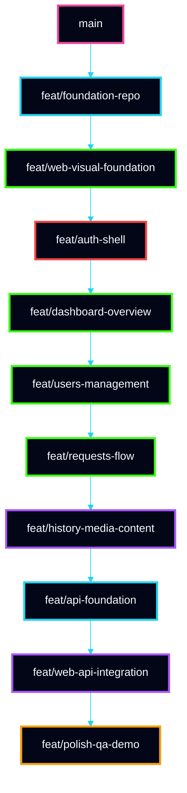
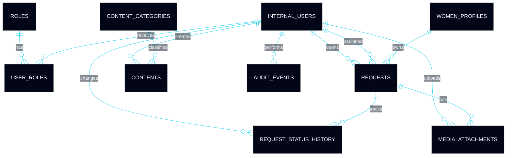

# 🚀 Terra Conecta — Dicionário de Execução do Protótipo Web
## Guia operacional, técnico e sequencial de implementação em 15 dias para VS Code

<div align="left">


</div>

> [!IMPORTANT]
> Este documento é um **dicionário de execução**. Ele existe para orientar, de forma detalhada, clara e incremental, a construção do protótipo web do **Terra Conecta** em **15 dias**, usando **VS Code** como ambiente principal de desenvolvimento, **branches por fase**, **commits previsíveis**, **estrutura de pastas controlada**, **instalação de bibliotecas com propósito explícito** e **sequência de entrega sem superengenharia**.

> [!NOTE]
> O objetivo não é apenas listar tarefas. O objetivo é entregar um **roteiro executável**, com ordem correta de implementação, explicação do papel de cada pasta e arquivo, estratégia de versionamento, matriz de banco de dados, organização por módulo e orientação prática suficiente para que o desenvolvimento seja seguido à risca.

> [!TIP]
> Este documento deve ser usado como referência operacional diária. A execução ideal é: **abrir a branch da fase, seguir a checklist da fase, construir os arquivos previstos, realizar os commits sugeridos e só então avançar**.

---

# 📚 Sumário Executivo

1. [Objetivo do Dicionário de Execução](#1-objetivo-do-dicionário-de-execução)  
2. [Princípios de Execução](#2-princípios-de-execução)  
3. [Ambiente Base de Trabalho no VS Code](#3-ambiente-base-de-trabalho-no-vs-code)  
4. [Stack e Bibliotecas com Finalidade Técnica](#4-stack-e-bibliotecas-com-finalidade-técnica)  
5. [Estratégia de Versionamento](#5-estratégia-de-versionamento)  
6. [Tree View das Branches](#6-tree-view-das-branches)  
7. [Sequência Macro de Execução em 15 Dias](#7-sequência-macro-de-execução-em-15-dias)  
8. [Fase 0 — Preparação do Ambiente](#8-fase-0--preparação-do-ambiente)  
9. [Fase 1 — Fundação do Repositório](#9-fase-1--fundação-do-repositório)  
10. [Fase 2 — Fundação Visual do Frontend](#10-fase-2--fundação-visual-do-frontend)  
11. [Fase 3 — Autenticação e Shell do Sistema](#11-fase-3--autenticação-e-shell-do-sistema)  
12. [Fase 4 — Dashboard Inicial](#12-fase-4--dashboard-inicial)  
13. [Fase 5 — Gestão de Usuárias](#13-fase-5--gestão-de-usuárias)  
14. [Fase 6 — Solicitações Operacionais](#14-fase-6--solicitações-operacionais)  
15. [Fase 7 — Histórico, Mídias e Conteúdo](#15-fase-7--histórico-mídias-e-conteúdo)  
16. [Fase 8 — Backend Mínimo Funcional](#16-fase-8--backend-mínimo-funcional)  
17. [Fase 9 — Integração Frontend + Backend](#17-fase-9--integração-frontend--backend)  
18. [Fase 10 — Refino, QA e Demo](#18-fase-10--refino-qa-e-demo)  
19. [Dicionário de Pastas e Arquivos](#19-dicionário-de-pastas-e-arquivos)  
20. [Matriz de Banco de Dados](#20-matriz-de-banco-de-dados)  
21. [Modelagem de Relacionamentos](#21-modelagem-de-relacionamentos)  
22. [Estratégia de Seeds e Dados de Demonstração](#22-estratégia-de-seeds-e-dados-de-demonstração)  
23. [Padrão de Branches por Fase](#23-padrão-de-branches-por-fase)  
24. [Padrão de Commits por Fase](#24-padrão-de-commits-por-fase)  
25. [Matriz de Entregáveis por Dia](#25-matriz-de-entregáveis-por-dia)  
26. [Checklist Final de Homologação](#26-checklist-final-de-homologação)  
27. [Recomendações Finais de Execução](#27-recomendações-finais-de-execução)

---

# 1. Objetivo do Dicionário de Execução

Este documento tem quatro objetivos centrais:

- orientar a implementação do protótipo de forma **sequencial e incremental**;
- reduzir improviso técnico durante a janela de 15 dias;
- deixar explícito **o que criar, quando criar, em qual branch criar e por quê**;
- servir como um guia operacional claro para o desenvolvedor trabalhando no **VS Code**.

## O que este dicionário cobre

- passo a passo técnico do desenvolvimento;
- estrutura inicial do repositório;
- pastas, arquivos e papel de cada um;
- bibliotecas a instalar;
- branches e commits recomendados;
- árvore lógica de branches;
- matriz de banco de dados;
- ordem correta de construção;
- estratégia de integração;
- critérios de fechamento por fase.

---

# 2. Princípios de Execução

A construção do protótipo seguirá estes princípios:

## 2.1 Construir primeiro o que sustenta o resto
Antes de criar telas de negócio, construir:
- monorepo;
- lint;
- build;
- roteamento;
- layout;
- autenticação base;
- contratos;
- seed.

## 2.2 Cada branch deve ter propósito único
Uma branch não deve misturar:
- dashboard com banco;
- autenticação com conteúdo;
- upload com refactor visual aleatório.

## 2.3 Cada fase deve deixar o sistema em melhor estado do que encontrou
Ao final de cada fase:
- projeto deve compilar;
- rotas não devem quebrar;
- lint deve passar;
- build deve continuar íntegro.

## 2.4 O frontend conduz o valor percebido
O backend entra de forma progressiva, sempre como sustentação e não como eixo dominante da complexidade.

## 2.5 A árvore de arquivos deve permanecer legível
Se um arquivo ou pasta não tem responsabilidade clara, ele não deve existir.

> [!IMPORTANT]
> Este dicionário não autoriza expansão espontânea de escopo. O objetivo é manter execução controlada, rastreável e consistente.

---

# 3. Ambiente Base de Trabalho no VS Code

## 3.1 Ferramentas obrigatórias na máquina

- **Node.js LTS**
- **pnpm**
- **Git**
- **VS Code**
- **Docker** opcional, mas recomendado para PostgreSQL local
- **Postman** ou **Insomnia** opcional para testar endpoints
- **TablePlus**, **DBeaver** ou equivalente para inspecionar banco

## 3.2 Extensões recomendadas do VS Code

- **ESLint**
- **Prettier**
- **EditorConfig for VS Code**
- **GitLens**
- **Error Lens**
- **Path Intellisense**
- **Prisma**
- **Tailwind CSS IntelliSense**
- **DotENV**
- **Markdown Preview Mermaid Support**

## 3.3 Organização recomendada do workspace no VS Code

Abrir a raiz do projeto `terra-conecta/` como workspace principal.

Estrutura recomendada no Explorer:
- `apps/web`
- `apps/api`
- `packages`
- `docs`

## 3.4 Arquivos de configuração recomendados para o VS Code

### `.vscode/extensions.json`
Sugere extensões para o time.

### `.vscode/settings.json`
Padroniza:
- format on save;
- default formatter;
- linting;
- comportamento do TypeScript;
- auto organize imports.

Exemplo:

```json
{
  "editor.formatOnSave": true,
  "editor.codeActionsOnSave": {
    "source.fixAll.eslint": "explicit",
    "source.organizeImports": "explicit"
  },
  "files.eol": "\n",
  "typescript.tsdk": "node_modules/typescript/lib"
}
```

---

# 4. Stack e Bibliotecas com Finalidade Técnica

## 4.1 Workspace e monorepo

### `pnpm`
Usado para:
- workspaces;
- velocidade de instalação;
- controle de dependências;
- baixo custo operacional.

### `turbo`
Usado para:
- organizar tasks;
- acelerar lint, build e dev;
- centralizar scripts do monorepo.

## 4.2 Frontend web

### Base
- `react`
- `react-dom`
- `typescript`
- `vite`

### Roteamento
- `react-router-dom`

### Cache e fetch
- `@tanstack/react-query`

### Formulários
- `react-hook-form`
- `zod`
- `@hookform/resolvers`

### UI
- `tailwindcss`
- `postcss`
- `autoprefixer`
- `class-variance-authority`
- `clsx`
- `tailwind-merge`
- `@radix-ui/react-dialog`
- `@radix-ui/react-dropdown-menu`
- `@radix-ui/react-tabs`
- `lucide-react`

### Tabelas e grids
- `@tanstack/react-table`

### Gráficos
- `recharts`

### Estado global leve
- `zustand`

### Upload
- `react-dropzone`

### Feedback
- `sonner`

### Datas
- `date-fns`

### Mock local para acelerar frontend
- `msw`

## 4.3 Backend API

### Base
- `@nestjs/common`
- `@nestjs/core`
- `@nestjs/platform-express`
- `reflect-metadata`
- `rxjs`

### Validação
- `zod` ou `class-validator` + `class-transformer`

Neste protótipo, manteremos:
- `zod` para frontend;
- `class-validator` no backend, se usar DTO clássico do Nest;
ou
- `zod` também no backend, se quiser padronizar menos superfícies.

### Banco
- `prisma`
- `@prisma/client`

### Auth
- `@nestjs/jwt`
- `passport`
- `passport-jwt`
- `@nestjs/passport`

### Upload
- `multer`

### Documentação
- `@nestjs/swagger`
- `swagger-ui-express`

### Logging
- logger do NestJS inicialmente
- opcionalmente `pino`

## 4.4 Qualidade e automação

- `eslint`
- `prettier`
- `husky`
- `lint-staged`
- `@commitlint/cli`
- `@commitlint/config-conventional`

---

# 5. Estratégia de Versionamento

## 5.1 Branch principal

- `main`  
Sempre estável, demonstrável e pronta para checkout seguro.

## 5.2 Branches de trabalho

Cada fase do protótipo terá branch própria, com foco claro.

## 5.3 Regra de ouro
Só avançar para a próxima branch quando:
- lint estiver verde;
- build estiver verde;
- a fase anterior estiver tecnicamente fechada.

## 5.4 Convenção de branches

- `feat/foundation-repo`
- `feat/web-visual-foundation`
- `feat/auth-shell`
- `feat/dashboard-overview`
- `feat/users-management`
- `feat/requests-flow`
- `feat/history-media-content`
- `feat/api-foundation`
- `feat/web-api-integration`
- `feat/polish-qa-demo`

## 5.5 Convenção de commits

- `chore(repo): initialize monorepo workspace`
- `feat(web): add app routing foundation`
- `feat(web): implement auth pages and protected routes`
- `feat(web): create dashboard overview widgets`
- `feat(web): build users listing and details pages`
- `feat(web): implement request workflow pages`
- `feat(api): create users module and contracts`
- `feat(api): add request endpoints and persistence`
- `feat(integration): connect dashboard and users flows`
- `fix(web): correct request timeline rendering`

---

# 6. Tree View das Branches

```text
main
├── feat/foundation-repo
├── feat/web-visual-foundation
├── feat/auth-shell
├── feat/dashboard-overview
├── feat/users-management
├── feat/requests-flow
├── feat/history-media-content
├── feat/api-foundation
├── feat/web-api-integration
└── feat/polish-qa-demo
```



---

# 7. Sequência Macro de Execução em 15 Dias

## Distribuição resumida

| Bloco | Dias | Foco |
|---|---:|---|
| Fundação | 1-3 | repo, workspace, layout, shell |
| Construção web principal | 4-10 | auth, dashboard, usuárias, solicitações, conteúdo |
| Backend e integração | 11-13 | API, banco, contratos, integração |
| Qualidade e entrega | 14-15 | QA, polish, demo |


---

# 8. Fase 0 — Preparação do Ambiente

## Branch
`feat/foundation-repo`

## Objetivo
Preparar a máquina, o repositório e o VS Code para que o restante do trabalho seja executado com previsibilidade.

## Passo a passo

### 8.1 Criar a pasta do projeto
```bash
mkdir terra-conecta
cd terra-conecta
git init
```

### 8.2 Criar arquivos iniciais da raiz
Criar:
- `package.json`
- `pnpm-workspace.yaml`
- `turbo.json`
- `.gitignore`
- `.editorconfig`
- `.prettierrc`
- `.eslintrc.cjs`
- `README.md`

### 8.3 Criar estrutura inicial de diretórios
```bash
mkdir -p apps/web apps/api apps/mobile packages docs .github/workflows .vscode
```

### 8.4 Inicializar `package.json` da raiz
Papel:
- centralizar scripts do monorepo;
- permitir execução de tasks por workspace.

### 8.5 Criar `pnpm-workspace.yaml`
Papel:
- informar que `apps/*` e `packages/*` participam do monorepo.

Exemplo:
```yaml
packages:
  - "apps/*"
  - "packages/*"
```

### 8.6 Criar `turbo.json`
Papel:
- organizar tasks como `dev`, `build`, `lint`, `typecheck`.

### 8.7 Criar `.gitignore`
Deve ignorar:
- `node_modules`
- `.turbo`
- `dist`
- `build`
- `.env`
- `.next`
- `coverage`
- `*.log`

### 8.8 Criar `.editorconfig`
Papel:
- padronizar indentação;
- evitar divergência entre ambientes.

### 8.9 Criar `.vscode/settings.json`
Papel:
- padronizar comportamento do editor.

### 8.10 Primeiro commit
```bash
git checkout -b feat/foundation-repo
git add .
git commit -m "chore(repo): initialize monorepo workspace"
```

---

# 9. Fase 1 — Fundação do Repositório

## Branch
Continua em `feat/foundation-repo`

## Objetivo
Subir o esqueleto do frontend, da API e dos pacotes compartilhados.

## Passo a passo

### 9.1 Criar app web com Vite
```bash
pnpm create vite apps/web --template react-ts
```

### 9.2 Criar app API com NestJS
Na prática, pode usar Nest CLI ou criar manualmente. Recomendado:
```bash
pnpm dlx @nestjs/cli new apps/api --package-manager pnpm
```

### 9.3 Criar package de design tokens
```bash
mkdir -p packages/design-tokens/src
```

### 9.4 Criar package de shared contracts
```bash
mkdir -p packages/shared-contracts/src
```

### 9.5 Instalar dependências da raiz
```bash
pnpm add -D turbo typescript eslint prettier husky lint-staged @commitlint/cli @commitlint/config-conventional
```

### 9.6 Configurar scripts da raiz
Adicionar scripts:
- `dev`
- `build`
- `lint`
- `typecheck`
- `format`

### 9.7 Subir lint e prettier
Criar configs mínimas e garantir execução inicial.

### 9.8 Commit recomendado
```bash
git add .
git commit -m "chore(repo): add web api and shared packages foundation"
```

---

# 10. Fase 2 — Fundação Visual do Frontend

## Branch
`feat/web-visual-foundation`

## Objetivo
Criar a base visual e estrutural do frontend antes de entrar em regras de negócio.

## Passo a passo

### 10.1 Criar a branch
```bash
git checkout main
git pull
git checkout -b feat/web-visual-foundation
```

### 10.2 Instalar bibliotecas do web
```bash
pnpm --filter web add react-router-dom @tanstack/react-query zustand zod react-hook-form @hookform/resolvers clsx tailwind-merge class-variance-authority lucide-react sonner date-fns
pnpm --filter web add -D tailwindcss postcss autoprefixer eslint prettier
```

### 10.3 Inicializar Tailwind
```bash
pnpm --filter web exec tailwindcss init -p
```

### 10.4 Criar estrutura base do frontend

Criar:
- `src/app/router`
- `src/app/providers`
- `src/app/layouts`
- `src/app/store`
- `src/modules`
- `src/lib`
- `src/assets`
- `src/mocks`

### 10.5 Criar `app/router/index.tsx`
Papel:
- registrar todas as rotas da aplicação;
- separar rotas públicas e protegidas;
- concentrar a navegação num ponto previsível.

### 10.6 Criar `app/layouts/app-layout.tsx`
Papel:
- estrutura macro do sistema autenticado;
- sidebar;
- topbar;
- conteúdo central.

### 10.7 Criar `app/providers/query-provider.tsx`
Papel:
- disponibilizar o `QueryClientProvider` globalmente.

### 10.8 Criar `shared/styles/tokens.ts`
Papel:
- padronizar cores, espaçamentos, tipografia, radius e sombras.

### 10.9 Criar `shared/components/app-sidebar.tsx`
Papel:
- renderizar menu principal;
- organizar acesso aos módulos.

### 10.10 Criar `shared/components/app-topbar.tsx`
Papel:
- exibir contexto do usuário;
- título da página;
- ações rápidas.

### 10.11 Criar `shared/components/page-header.tsx`
Papel:
- padronizar cabeçalho de páginas.

### 10.12 Commit recomendado
```bash
git add .
git commit -m "feat(web): create visual foundation and app shell structure"
```

---

# 11. Fase 3 — Autenticação e Shell do Sistema

## Branch
`feat/auth-shell`

## Objetivo
Entregar login, proteção de rotas, sessão e fluxo básico de entrada.

## Passo a passo

### 11.1 Criar estrutura do módulo auth

```text
src/modules/auth/
├── pages/
├── components/
├── services/
├── hooks/
└── model/
```

### 11.2 Criar `login-page.tsx`
Papel:
- tela pública de entrada;
- conter formulário e apoio visual institucional.

### 11.3 Criar `login-form.tsx`
Papel:
- inputs;
- validação;
- submit;
- exibição de erro.

### 11.4 Criar `auth-api.ts`
Papel:
- encapsular chamadas de autenticação;
- evitar fetch direto nas páginas.

### 11.5 Criar `session-store.ts`
Papel:
- armazenar sessão e usuário autenticado;
- permitir logout;
- expor estado para toda a aplicação.

### 11.6 Criar `protected-route.tsx`
Papel:
- bloquear acesso a rotas internas quando não houver sessão.

### 11.7 Criar `guest-route.tsx`
Papel:
- impedir que usuário autenticado volte para login desnecessariamente.

### 11.8 Criar mock inicial de login com MSW
Papel:
- desacoplar frontend do backend nesta etapa;
- permitir avanço visual e de fluxo.

### 11.9 Commit recomendado
```bash
git add .
git commit -m "feat(web): implement auth flow and protected shell"
```

---

# 12. Fase 4 — Dashboard Inicial

## Branch
`feat/dashboard-overview`

## Objetivo
Construir a primeira tela forte de demonstração.

## Passo a passo

### 12.1 Criar módulo dashboard
```text
src/modules/dashboard/
├── pages/
├── components/
├── services/
└── model/
```

### 12.2 Criar `dashboard-page.tsx`
Papel:
- orquestrar widgets da tela;
- consumir dados agregados do dashboard.

### 12.3 Criar `metrics-cards.tsx`
Papel:
- exibir KPIs principais.

### 12.4 Criar `status-panel.tsx`
Papel:
- mostrar estado resumido da operação.

### 12.5 Criar `recent-activity.tsx`
Papel:
- mostrar eventos recentes do sistema.

### 12.6 Criar `dashboard-chart.tsx`
Papel:
- representar visualmente volume de solicitações ou evolução simples.

### 12.7 Criar `quick-actions.tsx`
Papel:
- atalhos para cadastro, solicitação e conteúdo.

### 12.8 Commit recomendado
```bash
git add .
git commit -m "feat(web): add dashboard overview and operational widgets"
```

---

# 13. Fase 5 — Gestão de Usuárias

## Branch
`feat/users-management`

## Objetivo
Entregar o primeiro módulo operacional completo.

## Passo a passo

### 13.1 Criar estrutura do módulo users
```text
src/modules/users/
├── pages/
├── components/
├── services/
├── hooks/
└── model/
```

### 13.2 Criar `users-list-page.tsx`
Papel:
- listar usuárias;
- aplicar filtros;
- permitir navegação para detalhe.

### 13.3 Criar `users-table.tsx`
Papel:
- renderizar tabela reutilizável com colunas claras.

### 13.4 Criar `user-details-page.tsx`
Papel:
- exibir dados principais;
- apresentar histórico e solicitações relacionadas.

### 13.5 Criar `user-form-page.tsx`
Papel:
- criar e editar registro de usuária.

### 13.6 Criar `user-form.tsx`
Papel:
- encapsular campos e validação do formulário.

### 13.7 Criar `user-history-timeline.tsx`
Papel:
- exibir linha do tempo consolidada da usuária.

### 13.8 Criar `users-api.ts`
Papel:
- centralizar comunicação do módulo com API ou mock.

### 13.9 Criar hooks do módulo
- `use-users-list.ts`
- `use-user-details.ts`

Papel:
- separar carga de dados da camada de tela.

### 13.10 Commit recomendado
```bash
git add .
git commit -m "feat(web): build users management module"
```

---

# 14. Fase 6 — Solicitações Operacionais

## Branch
`feat/requests-flow`

## Objetivo
Entregar o fluxo central do produto: abertura, consulta e evolução de solicitações.

## Passo a passo

### 14.1 Criar estrutura do módulo requests
```text
src/modules/requests/
├── pages/
├── components/
├── services/
├── hooks/
└── model/
```

### 14.2 Criar `requests-list-page.tsx`
Papel:
- listar solicitações;
- filtrar por status, categoria e usuária.

### 14.3 Criar `request-create-page.tsx`
Papel:
- abrir nova solicitação vinculada a uma usuária.

### 14.4 Criar `request-form.tsx`
Papel:
- campos obrigatórios;
- categoria;
- descrição;
- priorização mínima.

### 14.5 Criar `request-details-page.tsx`
Papel:
- concentrar o núcleo operacional da solicitação.

### 14.6 Criar `request-timeline.tsx`
Papel:
- exibir evolução cronológica dos eventos da solicitação.

### 14.7 Criar `request-status-badge.tsx`
Papel:
- representar visualmente o status com padrão unificado.

### 14.8 Criar `requests-api.ts`
Papel:
- operações de listagem, criação, detalhe e atualização.

### 14.9 Criar hook `use-request-create.ts`
Papel:
- separar mutação da tela.

### 14.10 Commit recomendado
```bash
git add .
git commit -m "feat(web): implement request workflow module"
```

---

# 15. Fase 7 — Histórico, Mídias e Conteúdo

## Branch
`feat/history-media-content`

## Objetivo
Fechar a camada demonstrativa complementar do produto.

## Passo a passo

### 15.1 Criar módulo history
Papel:
- consolidar eventos do sistema.

### 15.2 Criar módulo content
Papel:
- listar e gerenciar materiais institucionais.

### 15.3 Criar `media-upload-panel.tsx`
Papel:
- permitir upload de mídia no contexto da solicitação.

### 15.4 Instalar lib de upload
```bash
pnpm --filter web add react-dropzone
```

### 15.5 Criar `content-list-page.tsx`
Papel:
- exibir catálogo de conteúdo.

### 15.6 Criar `content-details-page.tsx`
Papel:
- exibir material individual.

### 15.7 Criar `content-form-page.tsx`
Papel:
- cadastro e edição simples de conteúdo.

### 15.8 Criar `history-page.tsx`
Papel:
- visão ampla de histórico para reforço demonstrativo.

### 15.9 Commit recomendado
```bash
git add .
git commit -m "feat(web): add history media and content modules"
```

---

# 16. Fase 8 — Backend Mínimo Funcional

## Branch
`feat/api-foundation`

## Objetivo
Subir a API mínima com contratos, banco, persistência e autenticação básica.

## Passo a passo

### 16.1 Instalar dependências da API
```bash
pnpm --filter api add @nestjs/common @nestjs/core @nestjs/platform-express @nestjs/swagger swagger-ui-express class-validator class-transformer @nestjs/jwt @nestjs/passport passport passport-jwt multer @prisma/client
pnpm --filter api add -D prisma
```

### 16.2 Inicializar Prisma
```bash
pnpm --filter api exec prisma init
```

### 16.3 Criar estrutura base da API

```text
apps/api/src/
├── main.ts
├── app.module.ts
├── shared/
├── modules/
├── database/
└── test/
```

### 16.4 Criar `shared/config/env.ts`
Papel:
- ler e validar variáveis de ambiente.

### 16.5 Criar `shared/http/validation.pipe.ts`
Papel:
- validar payloads recebidos.

### 16.6 Criar `shared/auth/auth.guard.ts`
Papel:
- proteger rotas internas.

### 16.7 Criar `shared/database/prisma.service.ts`
Papel:
- encapsular o cliente Prisma e conexão com o banco.

### 16.8 Criar módulos da API

- `auth`
- `users`
- `requests`
- `content`
- `media`
- `dashboard`
- `history`
- `admin`

### 16.9 Criar contratos por módulo
Exemplo:
- `users.contracts.ts`
- `requests.contracts.ts`

Papel:
- documentar entradas e saídas;
- manter previsibilidade entre backend e frontend.

### 16.10 Criar DAOs
Papel:
- persistir;
- consultar;
- não decidir fluxo.

### 16.11 Criar services
Papel:
- orquestrar caso de uso;
- validar regra central.

### 16.12 Criar controllers
Papel:
- expor HTTP com clareza.

### 16.13 Commit recomendado
```bash
git add .
git commit -m "feat(api): create api foundation modules and persistence structure"
```

---

# 17. Fase 9 — Integração Frontend + Backend

## Branch
`feat/web-api-integration`

## Objetivo
Substituir mocks centrais por integração real nos fluxos prioritários.

## Passo a passo

### 17.1 Conectar auth real
Frontend passa a usar endpoint real de login.

### 17.2 Conectar dashboard
Carregar indicadores reais ou semi-reais do backend.

### 17.3 Conectar módulo users
Listagem, detalhe e cadastro com API real.

### 17.4 Conectar módulo requests
Fluxo principal de criação e consulta com API real.

### 17.5 Manter fallback local quando necessário
Se alguma borda não estiver pronta, manter comportamento controlado e explícito.

### 17.6 Revisar `http-client.ts`
Papel:
- base unificada de chamadas HTTP do web.

### 17.7 Commit recomendado
```bash
git add .
git commit -m "feat(integration): connect core web flows to api"
```

---

# 18. Fase 10 — Refino, QA e Demo

## Branch
`feat/polish-qa-demo`

## Objetivo
Fechar o protótipo como produto demonstrável.

## Passo a passo

### 18.1 Refinar estados visuais
- loading;
- vazio;
- erro;
- sucesso;
- badge;
- feedback.

### 18.2 Corrigir inconsistências de layout
- espaçamento;
- responsividade;
- títulos;
- hierarquia visual.

### 18.3 Refinar dados de demonstração
- seeds;
- fixtures;
- cenários plausíveis.

### 18.4 Revisar logs e erros
- mensagens legíveis;
- rastreabilidade mínima.

### 18.5 Criar roteiro de demo
Em `docs/execution/demo-script.md`

### 18.6 Criar checklist final
Em `docs/execution/checklist.md`

### 18.7 Commit recomendado
```bash
git add .
git commit -m "feat(polish): finalize qa visual refinement and demo readiness"
```

---

# 19. Dicionário de Pastas e Arquivos

## 19.1 Raiz do projeto

### `package.json`
Coordena scripts do monorepo.

### `pnpm-workspace.yaml`
Define workspaces.

### `turbo.json`
Define pipeline de tasks.

### `.github/workflows/`
Define CI.

### `docs/`
Guarda documentação viva.

## 19.2 `apps/web`

### `src/app/router`
Responsável por todas as rotas.

### `src/app/layouts`
Responsável pela moldura visual do sistema.

### `src/app/providers`
Responsável por providers globais.

### `src/app/store`
Responsável por estado global mínimo.

### `src/modules/*`
Cada módulo funcional possui:
- páginas;
- componentes;
- serviços;
- hooks;
- model.

### `src/modules/shared`
Tudo que for transversal de verdade no frontend.

### `src/lib`
Clientes técnicos comuns:
- HTTP;
- query client;
- utilidades técnicas.

### `src/mocks`
Mocks locais do frontend.

## 19.3 `apps/api`

### `src/shared`
Tudo que é transversal no backend:
- config;
- auth;
- http;
- logger;
- database;
- utils.

### `src/modules/*`
Cada módulo do backend concentra:
- controller;
- service;
- dao;
- contracts;
- rules.

### `database/prisma`
Schema e migrations.

## 19.4 `packages/design-tokens`
Tokens visuais compartilháveis.

## 19.5 `packages/shared-contracts`
Tipos e contratos reaproveitáveis, se o reuso for real.

> [!IMPORTANT]
> Não transformar `shared` em depósito. Cada item em `shared` precisa justificar sua transversalidade.

---

# 20. Matriz de Banco de Dados

## Entidades principais

- `internal_users`
- `roles`
- `user_roles`
- `women_profiles`
- `requests`
- `request_status_history`
- `media_attachments`
- `content_categories`
- `contents`
- `audit_events`

## 20.1 Tabela `roles`

| Coluna | Tipo | Regra |
|---|---|---|
| id | uuid | PK |
| code | varchar(50) | único |
| name | varchar(100) | obrigatório |
| created_at | timestamp | obrigatório |

## 20.2 Tabela `internal_users`

| Coluna | Tipo | Regra |
|---|---|---|
| id | uuid | PK |
| full_name | varchar(150) | obrigatório |
| email | varchar(150) | único |
| password_hash | varchar(255) | obrigatório |
| is_active | boolean | default true |
| created_at | timestamp | obrigatório |
| updated_at | timestamp | obrigatório |

## 20.3 Tabela `user_roles`

| Coluna | Tipo | Regra |
|---|---|---|
| id | uuid | PK |
| user_id | uuid | FK -> internal_users.id |
| role_id | uuid | FK -> roles.id |
| created_at | timestamp | obrigatório |

## 20.4 Tabela `women_profiles`

| Coluna | Tipo | Regra |
|---|---|---|
| id | uuid | PK |
| full_name | varchar(150) | obrigatório |
| document_number | varchar(30) | opcional |
| phone | varchar(30) | opcional |
| city | varchar(100) | opcional |
| state | varchar(100) | opcional |
| notes | text | opcional |
| status | varchar(30) | obrigatório |
| created_at | timestamp | obrigatório |
| updated_at | timestamp | obrigatório |

## 20.5 Tabela `requests`

| Coluna | Tipo | Regra |
|---|---|---|
| id | uuid | PK |
| woman_profile_id | uuid | FK -> women_profiles.id |
| category | varchar(50) | obrigatório |
| title | varchar(150) | obrigatório |
| description | text | obrigatório |
| priority | varchar(20) | obrigatório |
| status | varchar(30) | obrigatório |
| opened_by_user_id | uuid | FK -> internal_users.id |
| assigned_to_user_id | uuid | FK -> internal_users.id, opcional |
| created_at | timestamp | obrigatório |
| updated_at | timestamp | obrigatório |
| closed_at | timestamp | opcional |

## 20.6 Tabela `request_status_history`

| Coluna | Tipo | Regra |
|---|---|---|
| id | uuid | PK |
| request_id | uuid | FK -> requests.id |
| from_status | varchar(30) | opcional |
| to_status | varchar(30) | obrigatório |
| comment | text | opcional |
| changed_by_user_id | uuid | FK -> internal_users.id |
| created_at | timestamp | obrigatório |

## 20.7 Tabela `media_attachments`

| Coluna | Tipo | Regra |
|---|---|---|
| id | uuid | PK |
| request_id | uuid | FK -> requests.id |
| file_name | varchar(255) | obrigatório |
| mime_type | varchar(100) | obrigatório |
| file_size | integer | obrigatório |
| storage_key | varchar(255) | obrigatório |
| file_url | varchar(500) | opcional |
| uploaded_by_user_id | uuid | FK -> internal_users.id |
| created_at | timestamp | obrigatório |

## 20.8 Tabela `content_categories`

| Coluna | Tipo | Regra |
|---|---|---|
| id | uuid | PK |
| name | varchar(100) | obrigatório |
| slug | varchar(120) | único |
| created_at | timestamp | obrigatório |

## 20.9 Tabela `contents`

| Coluna | Tipo | Regra |
|---|---|---|
| id | uuid | PK |
| category_id | uuid | FK -> content_categories.id |
| title | varchar(180) | obrigatório |
| summary | text | opcional |
| body | text | obrigatório |
| status | varchar(30) | obrigatório |
| published_at | timestamp | opcional |
| created_by_user_id | uuid | FK -> internal_users.id |
| created_at | timestamp | obrigatório |
| updated_at | timestamp | obrigatório |

## 20.10 Tabela `audit_events`

| Coluna | Tipo | Regra |
|---|---|---|
| id | uuid | PK |
| actor_user_id | uuid | FK -> internal_users.id |
| entity_type | varchar(50) | obrigatório |
| entity_id | uuid | obrigatório |
| action | varchar(50) | obrigatório |
| metadata | jsonb | opcional |
| created_at | timestamp | obrigatório |

---

# 21. Modelagem de Relacionamentos



## Leitura prática dos relacionamentos

- uma usuária pode ter várias solicitações;
- uma solicitação pode ter vários eventos de histórico;
- uma solicitação pode ter vários anexos;
- conteúdos pertencem a categorias;
- usuários internos operam e auditam o sistema.

---

# 22. Estratégia de Seeds e Dados de Demonstração

## Objetivo
Garantir ambiente demonstrável sem depender de cadastro manual total.

## O que seedar

- perfis de acesso:
  - administradora
  - gestora
  - operadora

- usuárias:
  - pelo menos 10 registros plausíveis

- solicitações:
  - abertas
  - em andamento
  - concluídas

- histórico:
  - múltiplos eventos por solicitação

- conteúdos:
  - pelo menos 8 materiais distribuídos por categoria

## Benefício
A demo começa com:
- dados reais o suficiente;
- telas preenchidas;
- fluxos compreensíveis;
- menor improviso.

---

# 23. Padrão de Branches por Fase

| Fase | Branch | Objetivo |
|---|---|---|
| Preparação e repo | `feat/foundation-repo` | workspace, apps, lint, build |
| Base visual | `feat/web-visual-foundation` | layout, router, providers, tema |
| Auth | `feat/auth-shell` | login, sessão, rotas protegidas |
| Dashboard | `feat/dashboard-overview` | tela inicial e widgets |
| Usuárias | `feat/users-management` | listagem, detalhe, cadastro |
| Solicitações | `feat/requests-flow` | fluxo central operacional |
| Conteúdo e mídias | `feat/history-media-content` | histórico, biblioteca, upload |
| API | `feat/api-foundation` | backend, prisma, módulos |
| Integração | `feat/web-api-integration` | web consumindo API |
| Fechamento | `feat/polish-qa-demo` | qualidade, polish, demo |

---

# 24. Padrão de Commits por Fase

## Fundação
- `chore(repo): initialize monorepo workspace`
- `chore(repo): add turbo and workspace scripts`

## Frontend base
- `feat(web): create app shell and route foundation`
- `feat(web): add shared layout and theme tokens`

## Auth
- `feat(web): implement auth screens and session store`
- `feat(web): protect internal routes`

## Dashboard
- `feat(web): create dashboard widgets and overview page`

## Usuárias
- `feat(web): build users listing page`
- `feat(web): add user details and form flow`

## Solicitações
- `feat(web): implement request creation and details`
- `feat(web): add request timeline and status handling`

## API
- `feat(api): add prisma schema and database setup`
- `feat(api): create users requests and content modules`

## Integração
- `feat(integration): connect auth dashboard and users flows`
- `feat(integration): replace request mocks with api calls`

## Fechamento
- `fix(web): refine loading empty and error states`
- `feat(polish): finalize demo data and qa checklist`

---

# 25. Matriz de Entregáveis por Dia

| Dia | Entregável principal | Branch |
|---|---|---|
| 1 | Repo, monorepo, configs, apps base | `feat/foundation-repo` |
| 2 | Layout, router, providers, tema | `feat/web-visual-foundation` |
| 3 | Login, sessão, rotas protegidas | `feat/auth-shell` |
| 4 | Dashboard inicial | `feat/dashboard-overview` |
| 5 | Usuárias listagem e detalhe | `feat/users-management` |
| 6 | Usuárias cadastro e edição | `feat/users-management` |
| 7 | Solicitações listagem e criação | `feat/requests-flow` |
| 8 | Solicitações detalhe e timeline | `feat/requests-flow` |
| 9 | Histórico e upload | `feat/history-media-content` |
| 10 | Biblioteca e gestão de conteúdo | `feat/history-media-content` |
| 11 | API foundation e schema Prisma | `feat/api-foundation` |
| 12 | Módulos API + seed | `feat/api-foundation` |
| 13 | Integração frontend-backend | `feat/web-api-integration` |
| 14 | QA, refino visual, correções | `feat/polish-qa-demo` |
| 15 | Demo final e fechamento | `feat/polish-qa-demo` |

---

# 26. Checklist Final de Homologação

## Sistema
- [ ] `pnpm install` funciona sem erro
- [ ] `pnpm dev` sobe web e API
- [ ] `pnpm build` conclui com sucesso
- [ ] `pnpm lint` conclui com sucesso
- [ ] `pnpm typecheck` conclui com sucesso

## Frontend
- [ ] login funcional
- [ ] dashboard navegável
- [ ] módulo de usuárias íntegro
- [ ] módulo de solicitações íntegro
- [ ] conteúdo navegável
- [ ] upload demonstrável
- [ ] estados de loading, erro e vazio tratados

## Backend
- [ ] banco sobe corretamente
- [ ] Prisma migrado
- [ ] seed executável
- [ ] endpoints principais respondendo
- [ ] auth básica protegendo rotas

## Demonstração
- [ ] dados coerentes
- [ ] narrativa de uso clara
- [ ] nenhum fluxo principal quebrado
- [ ] ambiente de demo estável

---

# 27. Recomendações Finais de Execução

## O que fazer
- seguir as branches na ordem;
- fechar cada fase antes da próxima;
- manter commits pequenos e claros;
- documentar decisões quando surgirem;
- tratar a demo como requisito técnico real.

## O que não fazer
- não inflar `shared`;
- não antecipar abstrações desnecessárias;
- não começar backend complexo cedo demais;
- não misturar múltiplos escopos em uma só branch;
- não deixar integração inteira para o final.

> [!IMPORTANT]
> Este dicionário foi desenhado para permitir uma execução disciplinada, altamente orientada e rastreável. Se seguido corretamente, ele reduz improviso, protege o prazo e aumenta a chance de o protótipo terminar com aparência de produto real, base técnica legível e continuidade sustentável.
