# 🚀 Terra Conecta — Documento Técnico e Estratégico de Protótipo Web
## Plataforma de protótipo digital para assistência técnica, gestão operacional, inteligência de dados e estruturação comercial no ambiente rural

<div align="left">


</div>

> [!IMPORTANT]
> Este documento reposiciona a proposta como um **documento técnico e estratégico para execução de um protótipo web navegável**, com forte ênfase em **frontend de alta fidelidade**, **backend mínimo correto**, **organização arquitetural previsível**, **versionamento disciplinado** e **evolução sustentável sem superengenharia**.

> [!NOTE]
> O objetivo do protótipo não é simular a versão enterprise final. O objetivo é construir uma **versão funcional, convincente, tecnicamente coerente e operacionalmente demonstrável**, suficiente para validar jornada, interface, dados, regras centrais, narrativa institucional e viabilidade de evolução.

> [!TIP]
> A estratégia mais eficiente em uma janela curta é concentrar energia em **UX/UI, navegação, estados de tela, design system leve, contratos claros, persistência seletiva, dados de demonstração consistentes e stack com alta velocidade de execução**.

---

# 📚 Sumário Executivo

1. Visão do Protótipo  
2. Objetivo Estratégico e Técnico  
3. Premissas de Construção  
4. Diretriz Visual Global dos Diagramas Mermaid  
5. Escopo Executivo do Protótipo  
6. Escopo Funcional do Protótipo  
7. Fora de Escopo do Protótipo  
8. Perfis de Usuário e Jornadas  
9. Diretrizes Arquiteturais  
10. Arquitetura Recomendada do Protótipo  
11. Estratégia de Versionamento e Governança Técnica  
12. Bibliotecas e Ferramentas Recomendadas  
13. Diagramas Técnicos e Fluxos  
14. Stack Tecnológica  
15. Tree View Completa do Projeto  
16. Organização de Responsabilidades por Camada  
17. Matriz de Requisitos Funcionais  
18. Matriz de Requisitos Não Funcionais  
19. Matriz de Regras de Negócio  
20. Regras Operacionais Complementares  
21. Plano Técnico e Estratégico de Execução em 15 Dias  
22. Passo a Passo de Montagem do Protótipo  
23. Estratégia de Qualidade e Homologação  
24. Deploy, Operação e Sustentação do Protótipo  
25. Matriz de Estimativa de Custo  
26. Investimento Comercial  
27. Riscos e Mitigações  
28. Critérios de Sucesso  
29. Recomendações Finais

---

# 1. Visão do Protótipo

O **Terra Conecta** será conduzido, nesta fase, como um **protótipo web executável de alto valor demonstrativo**, orientado à validação rápida do produto e à apresentação institucional de uma solução com aparência, coerência e comportamento de software real.

A proposta do protótipo é:

- materializar a proposta de valor em jornadas navegáveis;
- validar fluxos críticos de operação;
- testar entendimento do produto por stakeholders;
- dar previsibilidade técnica para continuidade;
- reduzir risco de construção futura baseada apenas em discurso;
- provar a solução com uma base enxuta, mas organizada.

O frontend assume papel principal porque a percepção de maturidade, clareza operacional e potencial de adoção do produto dependerá diretamente da qualidade visual, da consistência dos fluxos e da solidez da experiência demonstrada.

## Resultado esperado

Ao final dos 15 dias, o protótipo deve demonstrar com consistência:

- login e entrada institucional;
- dashboard administrativo;
- gestão de usuárias;
- abertura e acompanhamento de solicitações;
- upload e listagem de mídias;
- histórico consolidado por usuária;
- biblioteca de conteúdos;
- segregação mínima de perfis;
- ambiente tecnicamente legível para continuidade.

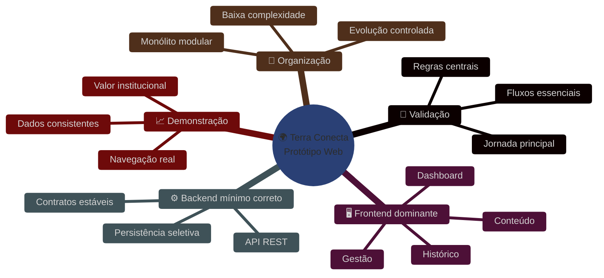

---

# 2. Objetivo Estratégico e Técnico

## Objetivo Estratégico

Construir um protótipo web executável capaz de:

- demonstrar valor de negócio de forma tangível;
- reduzir incerteza de produto;
- alinhar expectativa entre visão comercial, institucional e técnica;
- preparar a solução para uma fase posterior de implementação ampliada.

## Objetivo Técnico

Implantar uma base técnica com as seguintes propriedades:

- simples de construir;
- simples de manter;
- simples de entender;
- modular o bastante para crescer;
- contida o bastante para não colapsar em 15 dias.

## Objetivos específicos

- transformar a proposta em artefato navegável e demonstrável;
- priorizar frontend, UX e consistência visual;
- estabelecer contratos mínimos entre frontend e backend;
- registrar estrutura, convenções e decisões para continuidade;
- usar bibliotecas que acelerem entrega sem gerar dependência tóxica;
- manter o projeto versionado de forma disciplinada desde o primeiro dia.

---

# 3. Premissas de Construção

As decisões deste protótipo partem das seguintes premissas:

- o prazo é curto e exige foco radical;
- o frontend é a principal superfície de valor percebido;
- o backend existe para sustentar a demonstração, não para competir em complexidade;
- nem tudo precisa ser persistido de forma definitiva nesta fase;
- mocks são aceitáveis quando reduzem risco sem comprometer coerência;
- a árvore do projeto deve ser navegável por leitura curta;
- o time deve conseguir localizar responsabilidades sem “caça ao tesouro” entre arquivos;
- qualquer abstração só entra se simplificar o presente;
- microserviços, integrações extensas e orquestrações complexas ficam fora desta etapa.

> [!IMPORTANT]
> Em protótipo de ciclo curto, a disciplina de escopo vale mais do que sofisticação arquitetural. O erro estrutural mais comum é inflar backend, separar camadas cedo demais e perder tempo em fundações que não demonstram valor.

---

# 4. Diretriz Visual Global dos Diagramas

Todos os diagramas Mermaid deste documento devem seguir uma linguagem visual única, com padrão técnico e institucional consistente.

## Diretriz obrigatória

- **background sempre totalmente dark**, sem qualquer bloco cinza;
- **bordas em neon**, com uso intencional de cor para distinguir natureza da etapa;
- **linhas visíveis, limpas e modernas**;
- **texto claro e legível**;
- **sem aparência padrão do Mermaid**;
- **todas as fases representadas por cores diferentes quando houver sequência de execução**.

## Convenção cromática

| Tipo de fase | Cor principal | Uso |
|---|---|---|
| Fundação / Setup | `#22d3ee` | setup, estrutura, base |
| Construção principal | `#39ff14` | desenvolvimento central |
| Integração | `#a855f7` | conexão entre módulos |
| Qualidade / QA | `#f59e0b` | validação, testes, refino |
| Demonstração / Entrega | `#ec4899` | fechamento, demo, entrega |
| Persistência / Dados | `#06b6d4` | banco, storage, dados |
| Segurança / Controle | `#ef4444` | auth, proteção, permissão |

## Template visual padrão Mermaid

```mermaid
%%{init: {
'theme':'dark',
'themeVariables':{
'background':'#020617',
'mainBkg':'#020617',
'secondBkg':'#0f172a',
'tertiaryColor':'#111827',
'primaryColor':'#22d3ee',
'primaryTextColor':'#f8fafc',
'primaryBorderColor':'#39ff14',
'secondaryColor':'#0f172a',
'secondaryTextColor':'#e2e8f0',
'secondaryBorderColor':'#a855f7',
'lineColor':'#22d3ee',
'textColor':'#f8fafc',
'clusterBkg':'#020617',
'clusterBorder':'#a855f7',
'defaultLinkColor':'#22d3ee'
}}}%%
flowchart LR
A[Fundação] --> B[Construção]
B --> C[Integração]
C --> D[Qualidade]
D --> E[Entrega]

style A fill:#020617,stroke:#22d3ee,stroke-width:3px,color:#f8fafc
style B fill:#020617,stroke:#39ff14,stroke-width:3px,color:#f8fafc
style C fill:#020617,stroke:#a855f7,stroke-width:3px,color:#f8fafc
style D fill:#020617,stroke:#f59e0b,stroke-width:3px,color:#f8fafc
style E fill:#020617,stroke:#ec4899,stroke-width:3px,color:#f8fafc
```

> [!IMPORTANT]
> A partir deste documento, **todos os Mermaid seguem este padrão visual**, inclusive fluxogramas, diagramas de sequência, arquitetura, jornada, cronograma e integração.

---

# 5. Escopo Executivo do Protótipo

O protótipo será organizado em quatro frentes articuladas:

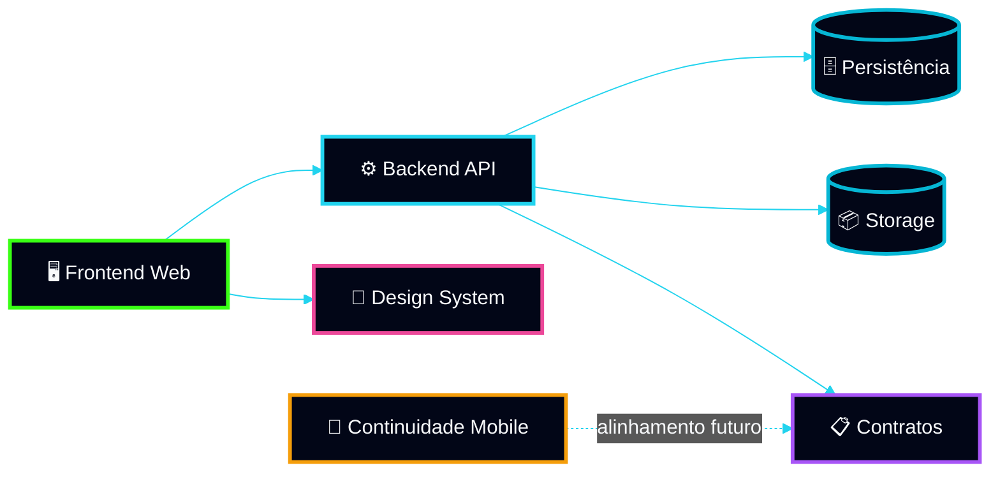

## Frentes contempladas

### 5.1 Frontend web de alta fidelidade
É a frente dominante do protótipo. Concentra:

- navegação;
- telas;
- estados;
- formulários;
- indicadores;
- filtros;
- componentes compartilhados;
- percepção de produto real.

### 5.2 Backend mínimo funcional
Sustenta o frontend com:

- API REST;
- autenticação básica;
- validações;
- contratos;
- persistência seletiva;
- dados agregados para telas principais.

### 5.3 Persistência e storage simplificados
Inclui apenas o necessário para:

- manter coerência demonstrativa;
- suportar cadastro, listagem, histórico e anexos;
- evitar fragilidade operacional durante a demo.

### 5.4 Continuidade estrutural para mobile
Não é foco da entrega, mas a organização considera reaproveitamento futuro de:

- domínio;
- contratos;
- nomenclatura;
- componentes conceituais;
- design tokens.

---

# 6. Escopo Funcional do Protótipo

## 6.1 Acesso e identidade
- login institucional;
- sessão autenticada;
- logout;
- proteção de rotas;
- perfil básico do usuário autenticado;
- recuperação simples ou simulada de acesso.

## 6.2 Dashboard inicial
- indicadores resumidos;
- cards operacionais;
- visão executiva da operação;
- atalhos para módulos;
- atividade recente.

## 6.3 Gestão de usuárias
- listagem;
- busca;
- filtros básicos;
- cadastro;
- edição;
- visualização de perfil;
- histórico consolidado.

## 6.4 Atendimento e solicitações
- criação de solicitação;
- categorização inicial;
- detalhe da solicitação;
- atualização de status;
- timeline operacional;
- vínculo com mídias.

## 6.5 Mídias e anexos
- upload controlado;
- associação por solicitação;
- listagem de anexos;
- metadados essenciais;
- visualização segura e demonstrável.

## 6.6 Conteúdo institucional
- listagem de materiais;
- filtros por categoria;
- detalhe;
- criação e edição simples;
- estado de publicação.

## 6.7 Histórico e rastreabilidade
- linha do tempo por usuária;
- registro de eventos relevantes;
- rastreio básico de alterações;
- visão consolidada de contexto operacional.

## 6.8 Administração básica
- perfis mínimos;
- separação entre leitura e edição;
- parâmetros iniciais do protótipo;
- controle administrativo elementar.

---

# 7. Fora de Escopo do Protótipo

Itens excluídos deliberadamente:

- microserviços;
- mensageria distribuída robusta;
- BI avançado;
- analytics preditivo;
- IA generativa;
- recomendação automatizada;
- offline-first complexo;
- workflows multiempresa;
- RBAC granular completo;
- observabilidade enterprise;
- integrações extensas com terceiros;
- automação complexa de negócio;
- aplicativo mobile entregue nesta fase.

> [!IMPORTANT]
> O protótipo deve provar valor e organização. Ele não deve tentar exibir “peso técnico” artificial.

---

# 8. Perfis de Usuário e Jornadas

## Perfis principais

### Gestora
Responsável por acompanhar visão macro da operação, indicadores resumidos e priorização.

### Operadora
Responsável pela execução cotidiana: cadastro, consulta, atualização e organização do fluxo.

### Administradora
Responsável por acesso, parâmetros básicos, revisão geral do ambiente e consistência operacional.

### Usuária Final
Não será o foco de interface nesta fase. Sua existência será refletida no sistema por registros, histórico e contexto operacional.

## Jornada macro

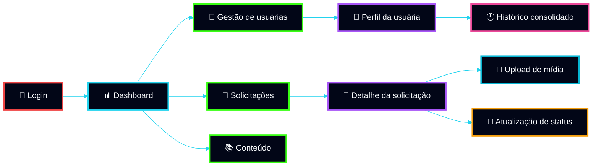

---

# 9. Diretrizes Arquiteturais

A arquitetura recomendada deve ser julgada por quatro critérios simultâneos:

1. **facilidade de construção**;  
2. **facilidade de manutenção**;  
3. **facilidade de entendimento**;  
4. **capacidade de evolução controlada**.  

## Princípios orientadores

### Monólito modular previsível
Tudo em um único sistema por aplicação principal, com separação por módulo funcional, evitando distribuição prematura.

### Fronteiras simples
Cada módulo deve ser localizável por domínio, com baixo custo cognitivo de navegação.

### Backend como sustentação
A API deve servir o frontend com objetividade, sem introduzir arquitetura ornamental.

### Fluxo visível
O leitor deve conseguir entender a execução principal com pouco salto entre arquivos.

### Separação apenas quando útil
DAO persiste. Service orquestra o caso de uso. Controller expõe o contrato. Shared só abriga reutilização real.

### Evolução sem antecipação excessiva
A estrutura deve permitir crescer, mas não deve cobrar complexidade agora para um futuro hipotético.

## Resultado arquitetural desejado

Uma base em que:

- novo desenvolvedor entenda a árvore rapidamente;
- ajustes de tela não exijam reinterpretação do sistema inteiro;
- contratos entre frontend e backend sejam evidentes;
- os módulos possam crescer internamente sem reescrever o projeto.

---

# 10. Arquitetura Recomendada do Protótipo

## Escolha arquitetural

A recomendação é um **monólito modular com frontend desacoplado e backend API simples**, organizado para alto entendimento operacional.

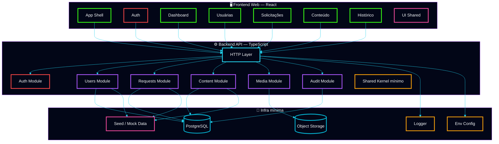

## Racional técnico

Essa arquitetura foi escolhida porque:

- reduz atrito de construção;
- evita separações prematuras;
- simplifica onboarding;
- mantém backend legível;
- suporta frontend com contratos claros;
- aceita futura extração apenas se o crescimento justificar.

## Decisão de organização

### Frontend
Modular por domínio funcional, com shared apenas para:
- componentes realmente reutilizáveis;
- hooks genéricos;
- utilidades de interface;
- tokens visuais.

### Backend
Modular por domínio com convenção curta:
- `controller` expõe;
- `service` coordena;
- `dao` persiste;
- `contracts` descrevem entrada/saída.

### Mobile
Permanece como continuidade estrutural e documental, sem diluir o foco da entrega atual.

---

# 11. Estratégia de Versionamento e Governança Técnica

O protótipo deve nascer com disciplina de versionamento, mesmo em uma janela curta. Isso reduz retrabalho, confusão em homologação e perda de rastreabilidade.

## Estratégia recomendada

### Repositório
Monorepo com workspaces, permitindo:
- versionamento centralizado;
- compartilhamento de scripts;
- padronização de lint, build e CI;
- organização unificada do protótipo.

### Branching
Modelo simples e eficaz:

- `main` → sempre estável e demonstrável;
- `develop` → integração contínua diária, se necessário;
- `feat/...` → uma fatia funcional por branch;
- `fix/...` → correções específicas;
- `docs/...` → documentação e decisões arquiteturais;
- `refactor/...` → ajustes internos sem alteração funcional.

### Convenção de nomes
Exemplos:
- `feat/auth-foundation`
- `feat/dashboard-overview`
- `feat/users-management`
- `feat/requests-flow`
- `feat/media-upload`
- `feat/content-library`
- `fix/request-status-flow`
- `docs/prototype-architecture`
- `refactor/web-shared-components`

### Commits
Adotar Conventional Commits:

- `feat(web): add users list page`
- `feat(api): implement request creation endpoint`
- `fix(web): correct request status badge mapping`
- `docs(architecture): describe prototype module boundaries`
- `refactor(api): simplify users service flow`
- `chore(repo): configure pnpm workspace and turbo`

### Tags e releases
Para demo e checkpoints executivos:

- `v0.1.0` — fundação pronta
- `v0.2.0` — frontend base navegável
- `v0.3.0` — módulos centrais integrados
- `v0.4.0` — demo candidate
- `v1.0.0-prototype` — entrega final do protótipo

### Pull requests
Cada PR deve ter:
- escopo pequeno;
- propósito único;
- descrição objetiva;
- imagens ou vídeo quando alterar UI;
- checklist de validação;
- impacto explícito no fluxo demonstrável.

## Governança mínima de qualidade

- lint obrigatório;
- typecheck obrigatório;
- build do web e API sem erro;
- smoke test dos fluxos principais antes de merge em `main`;
- revisão do impacto na demo antes de aceitar mudanças grandes.

> [!IMPORTANT]
> Em protótipos curtos, versionamento correto não é burocracia. É mecanismo de controle de risco.

---

# 12. Bibliotecas e Ferramentas Recomendadas

A seleção abaixo privilegia **velocidade de desenvolvimento**, **previsibilidade**, **boa manutenção** e **baixo atrito de onboarding**.

## Frontend web

### Base
- **React**
- **TypeScript**
- **Vite**

### Roteamento
- **React Router**

### Data fetching e cache
- **TanStack Query**

### Formulários
- **React Hook Form**
- **Zod**
- **@hookform/resolvers**

### UI / componentes
- **Tailwind CSS**
- **shadcn/ui**
- **Radix UI**
- **Lucide React**

### Tabelas e grids
- **TanStack Table**

### Gráficos
- **Recharts**

### Estado global leve
- **Zustand**

### Upload e drag and drop
- **react-dropzone**

### Datas e formatação
- **date-fns**

### Feedback visual
- **Sonner** ou **react-hot-toast**

### Qualidade de interface
- **clsx**
- **tailwind-merge**
- **class-variance-authority**

## Backend API

### Base
- **Node.js**
- **TypeScript**
- **NestJS**

### Validação
- **Zod** ou **class-validator** + **class-transformer**
- preferência prática: manter um padrão só por projeto

### Banco
- **PostgreSQL**

### ORM / Query builder
Escolha recomendada para protótipo de manutenção simples:
- **Prisma** para produtividade e legibilidade

Alternativa:
- **Kysely** se houver preferência por controle SQL tipado

### Upload / storage
- **Multer** para entrada de arquivos
- SDK compatível com **S3** ou storage local simples

### Auth
- **JWT**
- **Passport** apenas se realmente simplificar a implementação no contexto NestJS

### Logging
- **Pino** ou logger nativo do NestJS com organização simples

### Documentação técnica de API
- **Swagger / OpenAPI** para apoio interno e homologação

## Repositório e automação

- **pnpm**
- **Turbo** para tasks no monorepo
- **ESLint**
- **Prettier**
- **Husky**
- **lint-staged**
- **Commitlint**
- **GitHub Actions**

## Mobile de continuidade

- **Flutter**
- **Dart**
- apenas como trilha futura, sem peso na entrega atual

## Critério de uso de bibliotecas

Biblioteca entra quando:
- acelera visivelmente;
- reduz código repetitivo;
- melhora legibilidade;
- tem boa adoção e documentação;
- não impõe arquitetura acima do necessário.

Biblioteca não entra quando:
- substitui simplicidade por moda;
- exige curva desproporcional;
- cria dependência estrutural sem benefício imediato.

---

# 13. Diagramas Técnicos e Fluxos

## 13.1 Fluxo de autenticação e entrada

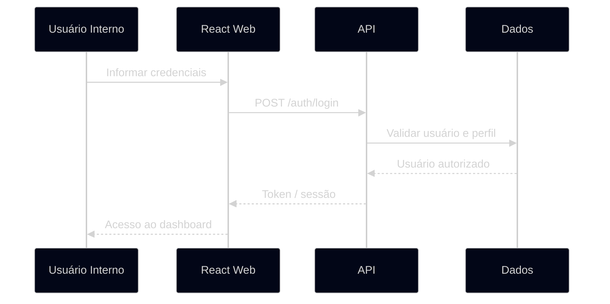

## 13.2 Fluxo de gestão de usuárias

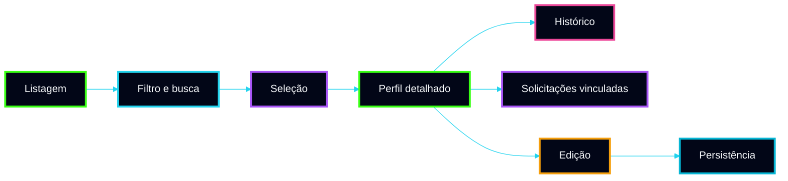

## 13.3 Fluxo de solicitação e atualização operacional

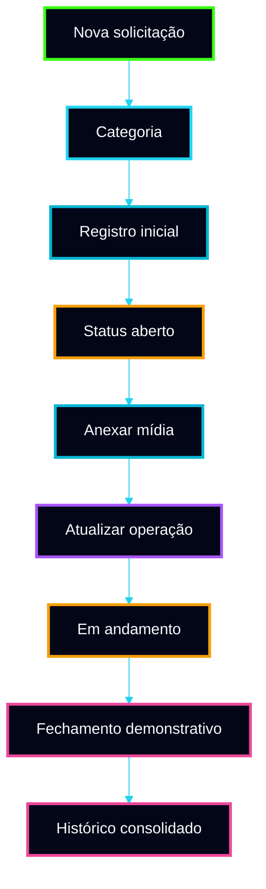

## 13.4 Fluxo técnico de upload de mídias

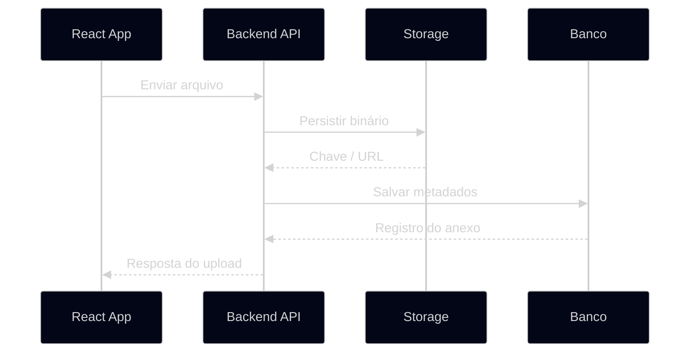

## 13.5 Fluxo de publicação de conteúdo


## 13.6 Fluxo de entrega em 15 dias

```mermaid
%%{init: {
'theme':'dark',
'themeVariables':{
'background':'#020617',
'mainBkg':'#020617',
'secondBkg':'#0f172a',
'tertiaryColor':'#111827',
'primaryColor':'#22d3ee',
'primaryTextColor':'#f8fafc',
'primaryBorderColor':'#39ff14',
'secondaryColor':'#0f172a',
'secondaryTextColor':'#e2e8f0',
'secondaryBorderColor':'#a855f7',
'lineColor':'#22d3ee',
'textColor':'#f8fafc',
'clusterBkg':'#020617',
'clusterBorder':'#a855f7',
'defaultLinkColor':'#22d3ee'
}}}%%
flowchart LR
A[Dia 1-2<br/>Fundação] --> B[Dia 3-5<br/>UI Base]
B --> C[Dia 6-8<br/>Módulos Centrais]
C --> D[Dia 9-11<br/>Integração]
D --> E[Dia 12-13<br/>Qualidade]
E --> F[Dia 14-15<br/>Demo]

style A fill:#020617,stroke:#22d3ee,stroke-width:3px,color:#f8fafc
style B fill:#020617,stroke:#39ff14,stroke-width:3px,color:#f8fafc
style C fill:#020617,stroke:#39ff14,stroke-width:3px,color:#f8fafc
style D fill:#020617,stroke:#a855f7,stroke-width:3px,color:#f8fafc
style E fill:#020617,stroke:#f59e0b,stroke-width:3px,color:#f8fafc
style F fill:#020617,stroke:#ec4899,stroke-width:3px,color:#f8fafc
```

---

# 14. Stack Tecnológica

## Frontend web
**React + TypeScript + Vite**

Motivos:
- velocidade de setup;
- ótimo ecossistema;
- excelente aderência para painéis administrativos;
- componentização rápida;
- ótima integração com bibliotecas modernas.

## Backend
**Node.js + TypeScript + NestJS**

Motivos:
- organização modular previsível;
- DI simples para APIs institucionais;
- facilidade de manutenção;
- forte aderência para times TypeScript.

## Banco de dados
**PostgreSQL**

Motivos:
- confiável;
- amplamente conhecido;
- suficiente para a modelagem do protótipo e continuidade futura.

## Persistência
**Prisma** como recomendação pragmática para o protótipo.

## Storage
**S3 compatível** ou storage local equivalente para demo.

## Mobile de continuidade
**Flutter**

Mantido como trilha de evolução, não como escopo executável da janela atual.

---

# 15. Tree View Completa do Projeto

A tree view abaixo foi desenhada para ser:

- pragmática;
- modular;
- fácil de manter;
- fácil de entender;
- direta quanto à responsabilidade;
- sem camadas ornamentais.

```text
terra-conecta/
├── apps/
│   ├── web/
│   │   ├── public/
│   │   │   ├── favicon.ico
│   │   │   ├── manifest.json
│   │   │   └── robots.txt
│   │   └── src/
│   │       ├── app/
│   │       │   ├── router/
│   │       │   │   ├── index.tsx
│   │       │   │   ├── protected-route.tsx
│   │       │   │   ├── guest-route.tsx
│   │       │   │   └── route-definitions.ts
│   │       │   ├── providers/
│   │       │   │   ├── auth-provider.tsx
│   │       │   │   ├── query-provider.tsx
│   │       │   │   ├── theme-provider.tsx
│   │       │   │   └── toast-provider.tsx
│   │       │   ├── layouts/
│   │       │   │   ├── app-layout.tsx
│   │       │   │   ├── auth-layout.tsx
│   │       │   │   └── dashboard-layout.tsx
│   │       │   ├── store/
│   │       │   │   ├── session-store.ts
│   │       │   │   └── ui-store.ts
│   │       │   └── config/
│   │       │       ├── env.ts
│   │       │       └── navigation.ts
│   │       ├── modules/
│   │       │   ├── auth/
│   │       │   │   ├── pages/
│   │       │   │   │   ├── login-page.tsx
│   │       │   │   │   └── forgot-password-page.tsx
│   │       │   │   ├── components/
│   │       │   │   │   ├── login-form.tsx
│   │       │   │   │   └── auth-hero.tsx
│   │       │   │   ├── services/
│   │       │   │   │   └── auth-api.ts
│   │       │   │   ├── hooks/
│   │       │   │   │   └── use-login.ts
│   │       │   │   └── model/
│   │       │   │       └── auth.types.ts
│   │       │   ├── dashboard/
│   │       │   │   ├── pages/
│   │       │   │   │   └── dashboard-page.tsx
│   │       │   │   ├── components/
│   │       │   │   │   ├── metrics-cards.tsx
│   │       │   │   │   ├── status-panel.tsx
│   │       │   │   │   ├── recent-activity.tsx
│   │       │   │   │   ├── dashboard-chart.tsx
│   │       │   │   │   └── quick-actions.tsx
│   │       │   │   ├── services/
│   │       │   │   │   └── dashboard-api.ts
│   │       │   │   └── model/
│   │       │   │       └── dashboard.types.ts
│   │       │   ├── users/
│   │       │   │   ├── pages/
│   │       │   │   │   ├── users-list-page.tsx
│   │       │   │   │   ├── user-details-page.tsx
│   │       │   │   │   └── user-form-page.tsx
│   │       │   │   ├── components/
│   │       │   │   │   ├── users-table.tsx
│   │       │   │   │   ├── user-summary-card.tsx
│   │       │   │   │   ├── user-history-timeline.tsx
│   │       │   │   │   ├── user-form.tsx
│   │       │   │   │   └── user-status-badge.tsx
│   │       │   │   ├── services/
│   │       │   │   │   └── users-api.ts
│   │       │   │   ├── hooks/
│   │       │   │   │   ├── use-users-list.ts
│   │       │   │   │   └── use-user-details.ts
│   │       │   │   └── model/
│   │       │   │       └── user.types.ts
│   │       │   ├── requests/
│   │       │   │   ├── pages/
│   │       │   │   │   ├── requests-list-page.tsx
│   │       │   │   │   ├── request-details-page.tsx
│   │       │   │   │   └── request-create-page.tsx
│   │       │   │   ├── components/
│   │       │   │   │   ├── requests-table.tsx
│   │       │   │   │   ├── request-status-badge.tsx
│   │       │   │   │   ├── request-timeline.tsx
│   │       │   │   │   ├── request-form.tsx
│   │       │   │   │   ├── request-summary-card.tsx
│   │       │   │   │   └── media-upload-panel.tsx
│   │       │   │   ├── services/
│   │       │   │   │   └── requests-api.ts
│   │       │   │   ├── hooks/
│   │       │   │   │   ├── use-requests-list.ts
│   │       │   │   │   ├── use-request-details.ts
│   │       │   │   │   └── use-request-create.ts
│   │       │   │   └── model/
│   │       │   │       └── request.types.ts
│   │       │   ├── content/
│   │       │   │   ├── pages/
│   │       │   │   │   ├── content-list-page.tsx
│   │       │   │   │   ├── content-details-page.tsx
│   │       │   │   │   └── content-form-page.tsx
│   │       │   │   ├── components/
│   │       │   │   │   ├── content-grid.tsx
│   │       │   │   │   ├── content-filters.tsx
│   │       │   │   │   ├── content-form.tsx
│   │       │   │   │   └── content-status-badge.tsx
│   │       │   │   ├── services/
│   │       │   │   │   └── content-api.ts
│   │       │   │   └── model/
│   │       │   │       └── content.types.ts
│   │       │   ├── history/
│   │       │   │   ├── pages/
│   │       │   │   │   └── history-page.tsx
│   │       │   │   ├── components/
│   │       │   │   │   ├── history-timeline.tsx
│   │       │   │   │   └── history-filters.tsx
│   │       │   │   ├── services/
│   │       │   │   │   └── history-api.ts
│   │       │   │   └── model/
│   │       │   │       └── history.types.ts
│   │       │   ├── admin/
│   │       │   │   ├── pages/
│   │       │   │   │   └── admin-settings-page.tsx
│   │       │   │   ├── components/
│   │       │   │   │   ├── permissions-panel.tsx
│   │       │   │   │   └── prototype-params-form.tsx
│   │       │   │   ├── services/
│   │       │   │   │   └── admin-api.ts
│   │       │   │   └── model/
│   │       │   │       └── admin.types.ts
│   │       │   └── shared/
│   │       │       ├── components/
│   │       │       │   ├── page-header.tsx
│   │       │       │   ├── data-table.tsx
│   │       │       │   ├── empty-state.tsx
│   │       │       │   ├── loading-state.tsx
│   │       │       │   ├── error-state.tsx
│   │       │       │   ├── app-sidebar.tsx
│   │       │       │   ├── app-topbar.tsx
│   │       │       │   ├── status-badge.tsx
│   │       │       │   ├── metric-card.tsx
│   │       │       │   ├── search-input.tsx
│   │       │       │   └── confirm-dialog.tsx
│   │       │       ├── hooks/
│   │       │       │   ├── use-pagination.ts
│   │       │       │   ├── use-debounce.ts
│   │       │       │   ├── use-query-params.ts
│   │       │       │   └── use-modal.ts
│   │       │       ├── utils/
│   │       │       │   ├── format-date.ts
│   │       │       │   ├── format-status.ts
│   │       │       │   ├── format-currency.ts
│   │       │       │   └── build-query-string.ts
│   │       │       ├── constants/
│   │       │       │   ├── roles.ts
│   │       │       │   ├── request-status.ts
│   │       │       │   └── content-status.ts
│   │       │       └── styles/
│   │       │           ├── tokens.ts
│   │       │           ├── theme.css
│   │       │           └── globals.css
│   │       ├── assets/
│   │       │   ├── icons/
│   │       │   ├── images/
│   │       │   └── illustrations/
│   │       ├── lib/
│   │       │   ├── http-client.ts
│   │       │   ├── query-client.ts
│   │       │   └── zod-error-map.ts
│   │       ├── mocks/
│   │       │   ├── browser.ts
│   │       │   ├── handlers/
│   │       │   │   ├── auth.handlers.ts
│   │       │   │   ├── users.handlers.ts
│   │       │   │   ├── requests.handlers.ts
│   │       │   │   ├── content.handlers.ts
│   │       │   │   └── dashboard.handlers.ts
│   │       │   └── data/
│   │       │       ├── users.mock.ts
│   │       │       ├── requests.mock.ts
│   │       │       ├── content.mock.ts
│   │       │       └── dashboard.mock.ts
│   │       ├── main.tsx
│   │       └── vite-env.d.ts
│   ├── api/
│   │   └── src/
│   │       ├── main.ts
│   │       ├── app.module.ts
│   │       ├── shared/
│   │       │   ├── config/
│   │       │   │   ├── env.ts
│   │       │   │   ├── app-config.ts
│   │       │   │   └── swagger.config.ts
│   │       │   ├── http/
│   │       │   │   ├── api-response.ts
│   │       │   │   ├── exception-filter.ts
│   │       │   │   ├── validation.pipe.ts
│   │       │   │   └── request-context.interceptor.ts
│   │       │   ├── auth/
│   │       │   │   ├── auth.guard.ts
│   │       │   │   ├── current-user.ts
│   │       │   │   └── jwt.strategy.ts
│   │       │   ├── logger/
│   │       │   │   └── logger.service.ts
│   │       │   ├── database/
│   │       │   │   ├── prisma.service.ts
│   │       │   │   └── prisma.module.ts
│   │       │   ├── storage/
│   │       │   │   ├── storage.module.ts
│   │       │   │   └── storage.service.ts
│   │       │   └── utils/
│   │       │       ├── date.util.ts
│   │       │       ├── pagination.util.ts
│   │       │       └── slug.util.ts
│   │       ├── modules/
│   │       │   ├── auth/
│   │       │   │   ├── auth.module.ts
│   │       │   │   ├── infra/
│   │       │   │   │   ├── auth.controller.ts
│   │       │   │   │   └── auth.service.ts
│   │       │   │   └── model/
│   │       │   │       └── auth.contracts.ts
│   │       │   ├── users/
│   │       │   │   ├── users.module.ts
│   │       │   │   ├── infra/
│   │       │   │   │   ├── users.controller.ts
│   │       │   │   │   ├── users.service.ts
│   │       │   │   │   └── users.dao.ts
│   │       │   │   └── model/
│   │       │   │       ├── users.contracts.ts
│   │       │   │       └── users.rules.ts
│   │       │   ├── requests/
│   │       │   │   ├── requests.module.ts
│   │       │   │   ├── infra/
│   │       │   │   │   ├── requests.controller.ts
│   │       │   │   │   ├── requests.service.ts
│   │       │   │   │   └── requests.dao.ts
│   │       │   │   └── model/
│   │       │   │       ├── requests.contracts.ts
│   │       │   │       └── requests.rules.ts
│   │       │   ├── content/
│   │       │   │   ├── content.module.ts
│   │       │   │   ├── infra/
│   │       │   │   │   ├── content.controller.ts
│   │       │   │   │   ├── content.service.ts
│   │       │   │   │   └── content.dao.ts
│   │       │   │   └── model/
│   │       │   │       ├── content.contracts.ts
│   │       │   │       └── content.rules.ts
│   │       │   ├── media/
│   │       │   │   ├── media.module.ts
│   │       │   │   ├── infra/
│   │       │   │   │   ├── media.controller.ts
│   │       │   │   │   ├── media.service.ts
│   │       │   │   │   └── media.dao.ts
│   │       │   │   └── model/
│   │       │   │       ├── media.contracts.ts
│   │       │   │       └── media.rules.ts
│   │       │   ├── dashboard/
│   │       │   │   ├── dashboard.module.ts
│   │       │   │   ├── infra/
│   │       │   │   │   ├── dashboard.controller.ts
│   │       │   │   │   └── dashboard.service.ts
│   │       │   │   └── model/
│   │       │   │       └── dashboard.contracts.ts
│   │       │   ├── history/
│   │       │   │   ├── history.module.ts
│   │       │   │   ├── infra/
│   │       │   │   │   ├── history.controller.ts
│   │       │   │   │   ├── history.service.ts
│   │       │   │   │   └── history.dao.ts
│   │       │   │   └── model/
│   │       │   │       └── history.contracts.ts
│   │       │   └── admin/
│   │       │       ├── admin.module.ts
│   │       │       ├── infra/
│   │       │       │   ├── admin.controller.ts
│   │       │       │   ├── admin.service.ts
│   │       │       │   └── admin.dao.ts
│   │       │       └── model/
│   │       │           └── admin.contracts.ts
│   │       ├── database/
│   │       │   ├── prisma/
│   │       │   │   ├── schema.prisma
│   │       │   │   ├── migrations/
│   │       │   │   └── seed.ts
│   │       │   └── fixtures/
│   │       │       ├── users.fixture.ts
│   │       │       ├── requests.fixture.ts
│   │       │       └── content.fixture.ts
│   │       └── test/
│   │           ├── e2e/
│   │           │   ├── auth.e2e-spec.ts
│   │           │   ├── users.e2e-spec.ts
│   │           │   └── requests.e2e-spec.ts
│   │           └── setup/
│   │               └── test-app.ts
│   └── mobile/
│       └── lib/
│           ├── app/
│           │   ├── router/
│           │   └── theme/
│           ├── modules/
│           ├── shared/
│           └── main.dart
├── packages/
│   ├── config-eslint/
│   ├── config-typescript/
│   ├── design-tokens/
│   └── shared-contracts/
├── docs/
│   ├── architecture/
│   │   ├── overview.md
│   │   ├── frontend-guidelines.md
│   │   ├── backend-guidelines.md
│   │   ├── module-boundaries.md
│   │   └── api-contracts.md
│   ├── execution/
│   │   ├── 15-day-plan.md
│   │   ├── checklist.md
│   │   ├── release-plan.md
│   │   └── demo-script.md
│   └── product/
│       ├── prototype-scope.md
│       ├── journeys.md
│       └── business-rules.md
├── .github/
│   └── workflows/
│       ├── ci.yml
│       ├── web-preview.yml
│       └── api-check.yml
├── package.json
├── pnpm-workspace.yaml
├── turbo.json
├── tsconfig.base.json
├── .env.example
├── .editorconfig
├── .gitignore
├── .prettierrc
├── .eslintrc.cjs
├── commitlint.config.cjs
└── README.md
```

## Leitura arquitetural da tree view

- `apps/web` concentra a entrega principal;
- `apps/api` sustenta domínio, contratos e persistência;
- `apps/mobile` é continuidade estrutural;
- `packages` evita duplicação real, não abstração ornamental;
- `docs` preserva continuidade de produto e arquitetura;
- `shared` é estritamente transversal e pequeno.

---

# 16. Organização de Responsabilidades por Camada

## Frontend Web
Responsável por:
- navegação;
- experiência de uso;
- formulários;
- componentes;
- estados visuais;
- apresentação e composição de dados;
- feedback ao usuário.

## Backend API
Responsável por:
- contratos HTTP;
- autenticação;
- validação de entrada;
- orquestração mínima dos casos de uso;
- agregação de dados;
- persistência seletiva.

## DAO / Persistência
Responsável apenas por:
- leitura;
- escrita;
- consultas;
- mapeamento para banco.

Não deve:
- decidir fluxo de negócio;
- conhecer regras de UI;
- assumir orquestração complexa.

## Shared / Pacotes compartilhados
Responsável apenas por:
- contratos genuinamente reutilizados;
- design tokens;
- configurações comuns;
- regras transversais reais.

---

# 17. Matriz de Requisitos Funcionais

| ID | Requisito | Descrição técnica | Prioridade | Origem |
|---|---|---|---|---|
| RF-01 | Login institucional | Permitir autenticação de usuários internos com sessão válida | Alta | Acesso |
| RF-02 | Proteção de rotas | Bloquear páginas internas sem sessão autenticada | Alta | Segurança |
| RF-03 | Dashboard | Exibir visão resumida da operação com métricas e atalhos | Alta | Operação |
| RF-04 | Listagem de usuárias | Permitir consulta com busca, filtros e navegação | Alta | Gestão |
| RF-05 | Cadastro de usuária | Permitir criação de registro com campos essenciais | Alta | Gestão |
| RF-06 | Edição de usuária | Permitir atualização de dados principais | Média | Gestão |
| RF-07 | Perfil da usuária | Exibir dados consolidados, histórico e solicitações vinculadas | Alta | Gestão |
| RF-08 | Criação de solicitação | Permitir abertura vinculada a usuária válida | Alta | Atendimento |
| RF-09 | Detalhe da solicitação | Exibir status, categoria, timeline e anexos | Alta | Atendimento |
| RF-10 | Atualização de status | Permitir evolução controlada do estado da solicitação | Alta | Atendimento |
| RF-11 | Upload de mídia | Permitir envio de imagem, áudio e vídeo com metadados | Alta | Mídia |
| RF-12 | Listagem de anexos | Exibir arquivos vinculados à solicitação | Alta | Mídia |
| RF-13 | Biblioteca de conteúdo | Exibir materiais por categoria com filtro e detalhe | Média | Conteúdo |
| RF-14 | Gestão de conteúdo | Permitir criar, editar e publicar material | Média | Conteúdo |
| RF-15 | Histórico consolidado | Exibir eventos relevantes por usuária | Alta | Rastreabilidade |
| RF-16 | Perfis mínimos | Distinguir acesso de leitura, operação e administração | Média | Administração |
| RF-17 | Feedback visual | Informar sucesso, erro, loading e estados vazios | Alta | UX |
| RF-18 | Dados demonstrativos coerentes | Popular o ambiente com cenários plausíveis para demo | Alta | Demonstração |

---

# 18. Matriz de Requisitos Não Funcionais

| ID | Requisito | Descrição técnica | Critério mínimo |
|---|---|---|---|
| RNF-01 | Performance de navegação | Telas principais devem carregar com fluidez em ambiente de demo | Navegação sem travamento perceptível |
| RNF-02 | Usabilidade | Fluxos devem ser claros, com baixa fricção operacional | Usuário consegue executar jornada principal sem instrução extensa |
| RNF-03 | Manutenibilidade | Estrutura modular e responsabilidades claras | Localização rápida de arquivos e baixa ambiguidade |
| RNF-04 | Consistência visual | Layout, componentes e estados devem seguir linguagem unificada | Aparência institucional e previsível |
| RNF-05 | Segurança básica | Rotas protegidas, validação de entrada e sessão controlada | Sem acesso indevido às áreas internas |
| RNF-06 | Observabilidade mínima | Logs suficientes para diagnosticar falhas centrais | Erro principal identificável durante homologação |
| RNF-07 | Escalabilidade estrutural | Projeto deve crescer por módulos sem reestruturação total imediata | Inclusão de novos módulos sem ruptura |
| RNF-08 | Confiabilidade demonstrativa | Demo não pode depender de integrações frágeis | Fluxo principal executável de ponta a ponta |
| RNF-09 | Portabilidade de ambiente | Ambiente deve subir com previsibilidade em dev e staging | Setup documentado e replicável |
| RNF-10 | Qualidade de código | Typecheck, lint e build devem permanecer íntegros | Pipeline local e CI verdes |
| RNF-11 | Versionamento disciplinado | Código, releases e checkpoints devem ser rastreáveis | Branches, tags e PRs consistentes |
| RNF-12 | Responsividade | Uso confortável em desktop e tablet | Layout sem quebra relevante |

---

# 19. Matriz de Regras de Negócio

| ID | Regra | Descrição | Impacto |
|---|---|---|---|
| RN-01 | Usuária única | Cada usuária deve possuir identificação única no protótipo | Integridade cadastral |
| RN-02 | Solicitação vinculada | Toda solicitação deve estar associada a uma usuária válida | Coerência operacional |
| RN-03 | Anexo contextual | Não existe anexo solto; todo arquivo deve pertencer a uma solicitação | Rastreabilidade |
| RN-04 | Status válido | Solicitações só podem assumir estados previstos no fluxo | Consistência de operação |
| RN-05 | Histórico derivado | Eventos relevantes devem gerar item de histórico quando aplicável | Auditoria básica |
| RN-06 | Conteúdo categorizado | Material institucional deve possuir categoria e estado | Organização da biblioteca |
| RN-07 | Publicação controlada | Conteúdo só aparece publicamente no módulo se estiver publicado | Coerência de catálogo |
| RN-08 | Administração restrita | Ações administrativas devem ser visíveis apenas a perfis adequados | Segurança básica |
| RN-09 | Campos obrigatórios | Cadastro e edição devem validar os campos mínimos do domínio | Qualidade do dado |
| RN-10 | Dados de demo coerentes | Dados mockados ou persistidos não podem contradizer a narrativa do sistema | Credibilidade da apresentação |
| RN-11 | Timeline contextual | Histórico deve apresentar ordem compreensível para leitura humana | Clareza operacional |
| RN-12 | Upload controlado | Tipos e tamanhos de arquivos aceitos devem seguir política mínima | Segurança e estabilidade |

---

# 20. Regras Operacionais Complementares

## Regras de fluxo
- não criar solicitação sem usuária;
- não anexar mídia sem solicitação;
- não publicar conteúdo sem categoria;
- não atualizar status para valor fora da máquina de estados simplificada;
- não permitir acesso administrativo a perfis não autorizados.

## Regras técnicas
- rotas e contratos devem usar nomenclatura consistente;
- DAOs não devem conter regra de negócio;
- controllers não devem absorver fluxo de orquestração;
- shared não deve virar depósito genérico;
- packages compartilhados só entram quando houver reuso real.

## Regras de demonstração
- sempre manter seed ou fixtures prontas;
- evitar dependência de internet para fluxos principais, quando possível;
- priorizar caminhos felizes estáveis;
- deixar fallback visual para partes ainda simuladas.

---

# 21. Plano Técnico e Estratégico de Execução em 15 Dias

## Estratégia geral

A execução será dividida em três blocos:

### Bloco 1 — Fundação
Definir escopo, árvore, design base, convenções e setup.

### Bloco 2 — Construção principal
Entregar telas, módulos e contratos que compõem o valor visível.

### Bloco 3 — Integração e validação
Conectar, estabilizar, validar e preparar a apresentação.

## Cronograma executivo

| Dia | Foco | Entrega |
|---|---|---|
| 1 | Kickoff técnico e escopo | mapa de telas, módulos e limites |
| 2 | Fundação do monorepo | estrutura, lint, build, versionamento |
| 3 | Base visual | layout, tema, sidebar, topbar |
| 4 | Autenticação | login, sessão, proteção de rotas |
| 5 | Dashboard | cards, indicadores, atalhos |
| 6 | Usuárias I | listagem, filtros, detalhe |
| 7 | Usuárias II | cadastro, edição, histórico |
| 8 | Solicitações I | listagem, criação |
| 9 | Solicitações II | detalhe, status, timeline |
| 10 | Mídias e conteúdo | upload, biblioteca, publicação |
| 11 | Backend mínimo | endpoints, contratos, persistência |
| 12 | Integração | frontend + backend + seed |
| 13 | Refino visual | UX, loading, feedbacks, ajustes |
| 14 | QA e homologação | smoke tests, correções |
| 15 | Demo | estabilização final e roteiro |

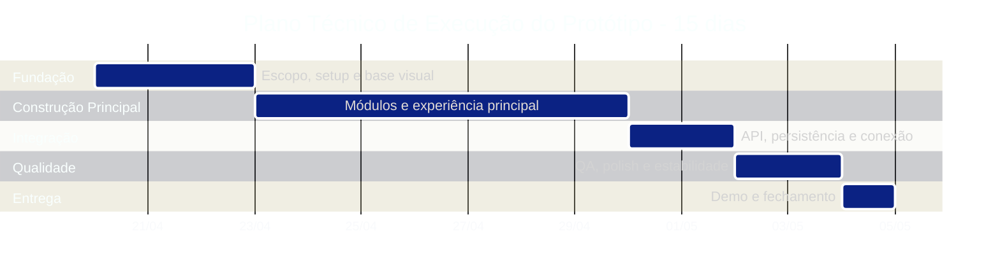

---

# 22. Passo a Passo de Montagem do Protótipo

## Etapa 1 — Congelar escopo real
Definir:
- telas obrigatórias;
- jornadas obrigatórias;
- dados obrigatórios;
- limites explícitos do que será mock e do que será persistido.

## Etapa 2 — Montar monorepo
Criar:
- `apps/web`
- `apps/api`
- `apps/mobile`
- `packages`
- `docs`

## Etapa 3 — Definir convenções
Estabelecer:
- naming;
- structure;
- commit pattern;
- padrão de PR;
- scripts de lint, typecheck e build.

## Etapa 4 — Subir frontend base
Implementar:
- router;
- layouts;
- design tokens;
- sidebar;
- topbar;
- estados visuais globais.

## Etapa 5 — Construir auth
Implementar:
- login;
- sessão;
- proteção de rotas;
- perfil autenticado.

## Etapa 6 — Construir dashboard
Implementar:
- KPIs;
- atalhos;
- painéis;
- atividade recente.

## Etapa 7 — Construir módulo de usuárias
Implementar:
- tabela;
- filtros;
- cadastro;
- edição;
- perfil;
- histórico.

## Etapa 8 — Construir módulo de solicitações
Implementar:
- listagem;
- criação;
- detalhe;
- status;
- timeline.

## Etapa 9 — Construir mídias e conteúdo
Implementar:
- upload;
- metadados;
- listagem de anexos;
- biblioteca;
- publicação simples.

## Etapa 10 — Subir backend mínimo
Implementar:
- contratos;
- controllers;
- services;
- DAOs;
- persistência e seed.

## Etapa 11 — Integrar ponta a ponta
Conectar:
- auth;
- dashboard;
- usuárias;
- solicitações;
- conteúdo;
- mídias.

## Etapa 12 — Refino
Ajustar:
- loading;
- erros;
- vazios;
- visual;
- responsividade.

## Etapa 13 — Homologar e preparar demo
Executar:
- smoke tests;
- checklist de apresentação;
- revisão de dados;
- roteiro final.

---

# 23. Estratégia de Qualidade e Homologação

## Princípios

- homologar fluxo completo, não apenas tela;
- validar o que sustenta a narrativa principal;
- manter a demo previsível;
- evitar dependência em bordas pouco relevantes.

## Camadas de validação

### Visual
- layout;
- alinhamento;
- consistência de componentes;
- tema;
- responsividade.

### Funcional
- login;
- dashboard;
- gestão de usuárias;
- solicitação;
- upload;
- conteúdo.

### Técnica
- build;
- lint;
- typecheck;
- endpoints;
- persistência;
- logs.

### Demonstrativa
- cenários de seed;
- caminhos felizes;
- narrativa de apresentação;
- fallback para partes simuladas.

## Critérios mínimos de homologação

- aplicação sobe sem erro;
- rotas principais navegáveis;
- módulos centrais executáveis;
- dados coerentes;
- visual maduro o suficiente para demo institucional;
- nenhum ponto crítico depende de improviso em apresentação.

---

# 24. Deploy, Operação e Sustentação do Protótipo

## Ambientes sugeridos
- desenvolvimento local;
- staging de demonstração;
- produção leve opcional para apresentação.

## Frontend
- build versionado;
- publicação em host estático ou plataforma simples;
- variáveis por ambiente;
- assets organizados.

## Backend
- serviço único;
- configuração de ambiente controlada;
- logs básicos;
- seed pronta;
- banco previsível.

## Operação
- checklist de subida do ambiente;
- dataset de demonstração controlado;
- reset simples de base se necessário;
- roteiro de fallback em caso de inconsistência.

---

# 25. Matriz de Estimativa de Custo

| Frente | Peso estimado | Faixa de esforço | Valor estimado |
|---|---:|---:|---:|
| Descoberta rápida, refinamento e arquitetura | 10% | alta concentração inicial | R$ 6.000 |
| UX/UI aplicada ao protótipo e design de telas | 18% | crítica para percepção de valor | R$ 10.800 |
| Frontend React do protótipo | 32% | frente principal da execução | R$ 19.200 |
| Backend TypeScript e contratos | 16% | suporte funcional e integração | R$ 9.600 |
| Módulo de mídias, dados e integração | 8% | fluxo demonstrativo essencial | R$ 4.800 |
| QA, refinamento visual e preparação de demo | 10% | estabilização final | R$ 6.000 |
| Documentação técnica e handoff | 6% | consolidação de continuidade | R$ 3.600 |
| **Total estimado** | **100%** |  | **R$ 60.000** |

---

# 26. Investimento Comercial

# 💎 Investimento Total Proposto: **R$ 60.000,00**

## Estrutura sugerida de pagamento

| Marco | Percentual | Valor |
|---|---:|---:|
| Assinatura e kickoff técnico | 35% | R$ 21.000 |
| Entrega da base estrutural e navegação principal | 25% | R$ 15.000 |
| Entrega dos módulos centrais integrados | 25% | R$ 15.000 |
| Entrega final, validação e demonstração | 15% | R$ 9.000 |

## O que o investimento cobre

- arquitetura pragmática do protótipo;
- construção de frontend demonstrável;
- backend mínimo funcional;
- contratos;
- organização modular;
- versionamento disciplinado;
- documentação de continuidade;
- preparação final para demo.

## O que não está incluído

- plataforma enterprise completa;
- operação contínua longa;
- integrações extensas não previstas;
- mobile completo em Flutter;
- escopo adicional fora do protótipo acordado.

---

# 27. Riscos e Mitigações

| Risco | Probabilidade | Impacto | Nível | Mitigação |
|---|---|---|---|---|
| Crescimento de escopo | Alta | Alto | Crítico | congelar escopo até o Dia 2 |
| Excesso de backend | Média | Alto | Alto | proteger arquitetura do protótipo contra inflar serviço e persistência |
| Refino visual insuficiente | Média | Alto | Alto | reservar polish real nos dias finais |
| Integração tardia | Média | Alto | Alto | conectar progressivamente e não apenas ao final |
| Dados incoerentes | Média | Médio | Moderado | preparar seeds e fixtures desde cedo |
| Tree view inflada | Média | Médio | Moderado | revisar shared, packages e módulos com critério |
| Falta de disciplina em versionamento | Média | Médio | Moderado | definir branches, releases e PR pattern no início |

> [!IMPORTANT]
> O maior risco do protótipo não é falta de tecnologia. É perder foco por excesso de ambição estrutural.

---

# 28. Critérios de Sucesso

O protótipo será considerado bem-sucedido se existir ao final:

- jornada de login até operação principal;
- dashboard coerente;
- gestão de usuárias funcional;
- solicitações demonstráveis;
- upload e mídias funcionando;
- histórico crível;
- biblioteca institucional navegável;
- backend suficientemente estável;
- organização técnica legível;
- versionamento e documentação que permitam continuidade.

## Indicadores qualitativos

- produto “parece real”;
- quem assiste entende rápido;
- a demo flui sem improviso;
- o código mostra ordem;
- o próximo ciclo pode começar sem reconstrução total.

---

# 29. Recomendações Finais

A melhor decisão para o **Terra Conecta** nesta etapa é construir um **protótipo web visualmente forte, tecnicamente enxuto e estruturalmente disciplinado**.

## Síntese de recomendação

- tratar frontend como centro do valor percebido;
- manter backend pequeno, correto e legível;
- usar monólito modular;
- versionar com disciplina desde o início;
- acelerar com bibliotecas maduras;
- preservar tree view limpa;
- detalhar regras, requisitos e contratos;
- integrar cedo;
- reservar tempo real para polish e demo.

> [!IMPORTANT]
> O valor desta entrega não está em simular uma arquitetura enterprise completa. Está em apresentar um protótipo convincente, moderno, bem organizado, tecnicamente defensável e pronto para sustentar a próxima fase sem recomeço estrutural.
