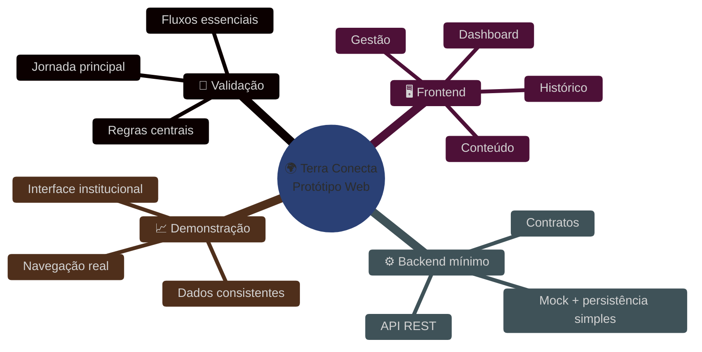
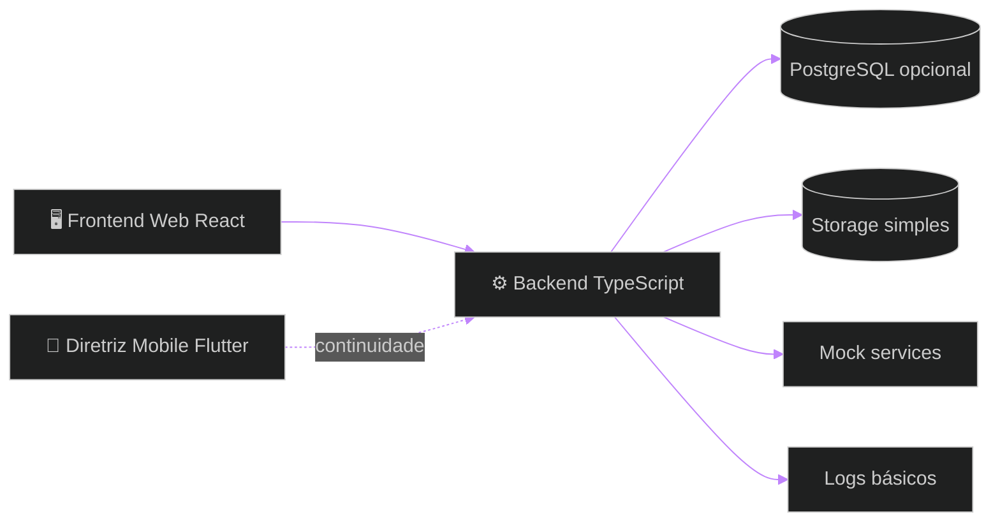
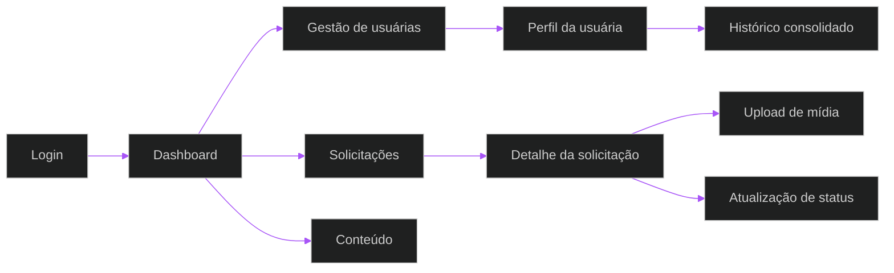
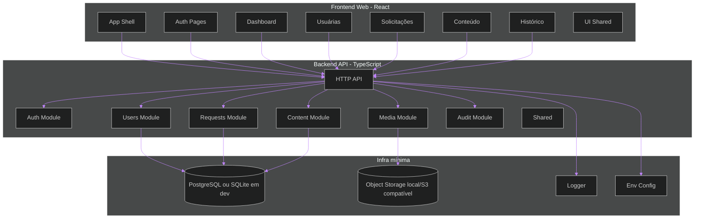
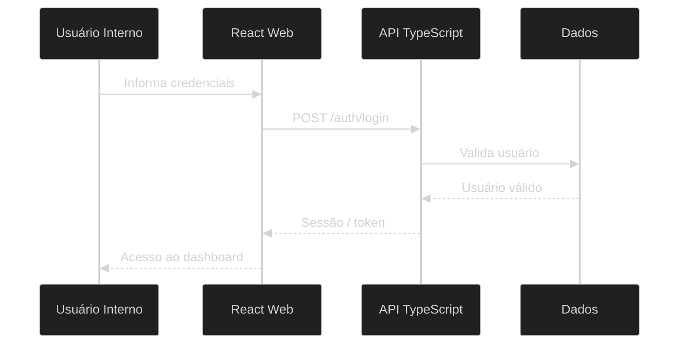
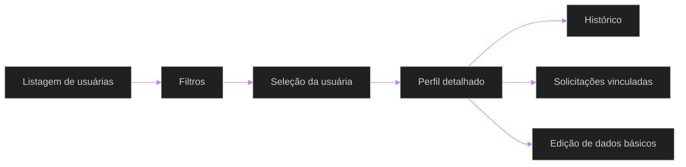
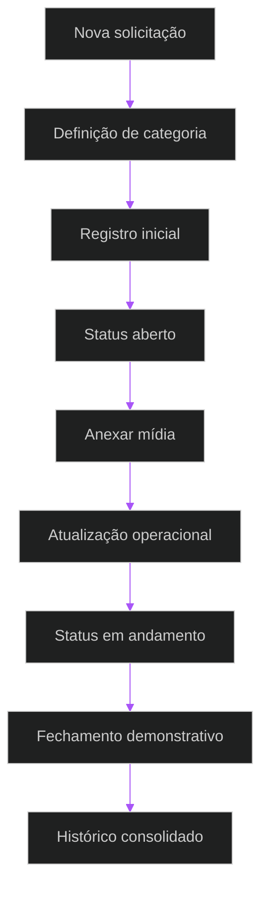
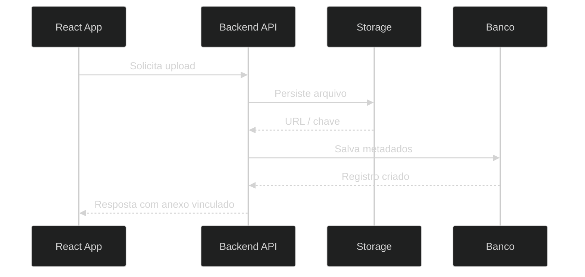
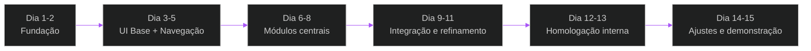
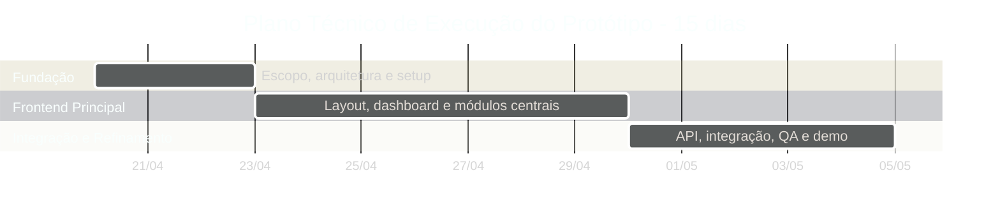

# 🚀 Terra Conecta — Documento Técnico e Estratégico de Protótipo Web
## Plataforma de protótipo digital para assistência técnica, gestão operacional, inteligência de dados e estruturação comercial no ambiente rural

<div align="left">


</div>

> [!IMPORTANT]
> Este documento reposiciona a proposta original como um **documento técnico e estratégico para execução de um protótipo web**, com foco em validação rápida, organização arquitetural previsível, forte atenção à experiência de frontend e base suficiente para evolução posterior sem superengenharia.

> [!NOTE]
> O objetivo deste protótipo não é entregar uma plataforma enterprise completa em 15 dias. O objetivo é construir uma **versão navegável, funcional, coerente e tecnicamente sustentável**, capaz de validar jornadas, regras centrais, interface, estrutura de dados e visão operacional.

> [!TIP]
> Para este contexto, a decisão mais eficiente é concentrar esforço em **frontend de alta fidelidade**, backend mínimo porém correto, contratos estáveis, dados simulados ou parcialmente persistidos e arquitetura modular simples.

---

# 📚 Sumário Executivo

1. Visão do Protótipo  
2. Objetivo Estratégico e Técnico  
3. Premissas de Construção  
4. Escopo Executivo do Protótipo  
5. Escopo Funcional do Protótipo  
6. Fora de Escopo do Protótipo  
7. Perfis de Usuário e Jornadas  
8. Diretrizes Arquiteturais  
9. Arquitetura Recomendada do Protótipo  
10. Diagramas Técnicos e Fluxos  
11. Stack Tecnológica  
12. Tree View do Projeto  
13. Organização de Responsabilidades por Camada  
14. Requisitos Funcionais  
15. Requisitos Não Funcionais  
16. Regras de Negócio  
17. Plano Técnico e Estratégico de Execução em 15 Dias  
18. Passo a Passo de Montagem do Protótipo  
19. Estratégia de Qualidade e Homologação  
20. Deploy, Operação e Sustentação do Protótipo  
21. Matriz de Estimativa de Custo  
22. Investimento Comercial  
23. Riscos e Mitigações  
24. Critérios de Sucesso  
25. Recomendações Finais

---

# 1. Visão do Protótipo

O **Terra Conecta** será tratado, nesta fase, como um **protótipo web de alto valor demonstrativo**, com foco em validar a experiência principal da solução, consolidar a narrativa de produto e estruturar uma base técnica inicial organizada.

O protótipo deverá permitir:

- demonstrar a proposta de valor da solução de forma tangível;
- validar jornadas centrais de uso;
- apresentar uma interface institucional de alto nível;
- simular uma operação real com consistência visual e funcional;
- estabelecer uma base técnica inicial sem inflar a arquitetura.

Neste contexto, o frontend assume papel dominante, porque é nele que a percepção de valor, clareza operacional e maturidade do produto se tornam visíveis já no primeiro ciclo.

## Resultado esperado

Ao final dos 15 dias, o protótipo deve ser capaz de demonstrar:

- acesso e navegação principal;
- dashboard administrativo;
- cadastro e consulta de usuárias;
- abertura e acompanhamento de solicitações;
- upload e listagem de mídias em fluxo controlado;
- histórico consolidado por usuária;
- biblioteca de conteúdos;
- visão institucional coerente e apresentável.



---

# 2. Objetivo Estratégico e Técnico

## Objetivo Estratégico

Construir um protótipo web executável que permita validar a proposta de produto, alinhar expectativas, demonstrar valor institucional e reduzir incerteza antes de uma implementação ampliada.

## Objetivo Técnico

Implantar uma base técnica modular, simples e previsível, orientada por responsabilidades claras, com backend em TypeScript, frontend web em React, organização preparada para evolução e apoio conceitual de frontend mobile em Flutter para continuidade futura.

## Objetivos específicos

- transformar a proposta executiva em artefato técnico executável;
- priorizar experiência de frontend e clareza de navegação;
- construir contratos mínimos entre frontend e backend;
- reduzir risco de retrabalho arquitetural;
- criar uma árvore de projeto limpa e compreensível;
- viabilizar demonstração institucional com aparência de produto real.

---

# 3. Premissas de Construção

Para manter viabilidade real em 15 dias, o protótipo será guiado pelas premissas abaixo:

- foco em fluxos principais, não em cobertura total;
- frontend com prioridade de acabamento acima de profundidade operacional;
- backend com escopo controlado e responsabilidade objetiva;
- persistência simples e seletiva;
- uso de dados mockados quando isso acelerar validação sem comprometer coerência;
- autenticação simples, mas consistente com a narrativa do produto;
- arquitetura monolítica modular, evitando distribuição prematura;
- código organizado por domínio e responsabilidade;
- ausência de abstrações ornamentais sem ganho imediato.

> [!IMPORTANT]
> Em protótipo de 15 dias, o maior erro é tentar reproduzir a versão final do produto. O protótipo deve ser fiel ao problema, não maximalista na solução.

---

# 4. Escopo Executivo do Protótipo

O protótipo será organizado em três frentes coordenadas.



## Frentes contempladas

### 4.1 Frontend Web de alta fidelidade
Camada principal do protótipo, responsável por traduzir a experiência de uso, fluxos administrativos, percepção institucional e usabilidade.

### 4.2 Backend mínimo funcional
Camada de suporte com API REST, validações, estruturas de domínio e persistência controlada apenas onde necessário para sustentar a demonstração.

### 4.3 Diretriz de continuidade mobile
Estrutura conceitual para futura implementação em Flutter, mantendo alinhamento de design system, contratos e organização de domínio.

---

# 5. Escopo Funcional do Protótipo

## 5.1 Acesso e identidade
- tela de login institucional;
- recuperação simples de acesso;
- sessão autenticada simulada ou real;
- perfil básico do usuário autenticado;
- logout e proteção de rotas principais.

## 5.2 Dashboard inicial
- visão resumida da operação;
- cards com métricas principais;
- atalhos para áreas centrais;
- painel com estado da operação;
- visão executiva inicial.

## 5.3 Gestão de usuárias
- listagem com filtros básicos;
- cadastro de usuária;
- edição simples de dados principais;
- visualização de perfil;
- histórico consolidado por usuária.

## 5.4 Atendimento e solicitações
- criação de solicitação;
- categorização inicial;
- status operacional;
- visualização detalhada;
- acompanhamento por timeline;
- atualização simples por perfis internos.

## 5.5 Mídias e anexos
- upload controlado de imagem, áudio e vídeo;
- associação ao registro correto;
- listagem de anexos por solicitação;
- visualização de metadados;
- fluxo demonstrável mesmo com storage simplificado.

## 5.6 Conteúdo institucional
- listagem de materiais;
- filtro por categoria;
- tela de detalhe;
- cadastro e publicação simples no painel;
- visual coerente com biblioteca institucional.

## 5.7 Histórico e rastreabilidade
- timeline por usuária;
- visualização de interações relevantes;
- histórico de solicitações;
- rastreio de atualizações principais;
- base para auditoria simples.

## 5.8 Administração básica
- perfis de acesso simulados ou iniciais;
- segregação entre visualização e edição;
- estrutura de permissões mínima;
- área de parâmetros iniciais do protótipo.

---

# 6. Fora de Escopo do Protótipo

Itens deliberadamente excluídos desta fase:

- arquitetura de microserviços;
- mensageria distribuída robusta;
- BI avançado;
- analytics preditivo;
- motores de recomendação;
- IA generativa embarcada;
- modo offline complexo;
- integrações extensas com sistemas terceiros;
- workflows multiempresa avançados;
- RBAC sofisticado com matriz granular completa;
- observabilidade enterprise completa;
- automações de negócio complexas.

> [!IMPORTANT]
> O protótipo deve validar valor, não exibir volume técnico artificial.

---

# 7. Perfis de Usuário e Jornadas

## Perfis principais

### Gestora
Acompanha indicadores, vê o estado da operação e acessa relatórios resumidos.

### Operadora
Cadastra, consulta, acompanha solicitações, atualiza status e organiza o fluxo operacional.

### Administradora
Configura perfis básicos, revisa consistência do ambiente e supervisiona acessos principais.

### Usuária Final
Neste protótipo web, sua presença será demonstrada majoritariamente por registros, histórico e fluxos refletidos no painel. A interface mobile permanece como continuidade prevista.

## Jornada macro do protótipo



---

# 8. Diretrizes Arquiteturais

A arquitetura deve seguir princípios de execução enxuta:

- monólito modular previsível;
- fronteiras simples entre módulos;
- contratos explícitos;
- baixa navegação mental entre arquivos;
- responsabilidade clara por camada;
- backend sustentando o frontend, não competindo com ele em complexidade;
- organização para evolução sem antecipar extrações.

## Princípios de decisão

### Simplicidade operacional
Cada módulo deve ser compreendido com leitura curta e fluxo visível.

### Modularidade pragmática
Separar por domínio apenas quando isso melhora clareza, não por gosto arquitetural.

### Frontend-first no protótipo
A maior energia deve estar em telas, estados, componentes, navegação e consistência visual.

### Backend como sustentação
A API precisa ser correta, pequena e estável. Não deve inflar a solução.

### Evolução controlada
A base deve aceitar continuidade futura, mas sem introduzir camadas abstratas não utilizadas agora.

---

# 9. Arquitetura Recomendada do Protótipo

## Escolha arquitetural

A recomendação é um **monólito modular com frontend desacoplado**, composto por:

- frontend web React como núcleo demonstrativo;
- backend TypeScript com API REST simples;
- persistência seletiva;
- organização por domínios funcionais;
- design system leve e reutilizável;
- possibilidade futura de reaproveitar contratos e modelo em Flutter.



## Racional

Essa composição permite:

- entrega rápida;
- leitura arquitetural simples;
- boa experiência demonstrativa;
- sustentação mínima técnica;
- futura continuidade sem retrabalho estrutural grave.

---

# 10. Diagramas Técnicos e Fluxos

## 10.1 Fluxo de autenticação e entrada



## 10.2 Fluxo de gestão de usuárias



## 10.3 Fluxo de solicitação e atualização operacional



## 10.4 Fluxo técnico de upload de mídias



## 10.5 Fluxo de publicação de conteúdo


## 10.6 Fluxo de entrega do protótipo em 15 dias



---

# 11. Stack Tecnológica

## Frontend Web
**React + TypeScript**

Motivos:
- alta produtividade para interfaces administrativas;
- excelente aderência a prototipação navegável;
- bom ecossistema para tabelas, formulários e dashboards;
- facilidade de componentização;
- forte compatibilidade com design system.

## Mobile de continuidade
**Flutter**

Motivos:
- preparação para evolução posterior do canal mobile;
- boa aderência a interface orientada a jornada;
- compartilhamento conceitual de design e contratos.

## Backend
**TypeScript com NestJS ou estrutura HTTP modular equivalente**

Motivos:
- contratos claros;
- organização modular previsível;
- boa manutenção em time pequeno;
- forte aderência a APIs institucionais.

## Banco de dados
**PostgreSQL**

Para o protótipo, pode ser substituído localmente por opção simplificada em desenvolvimento, desde que contratos e estrutura de domínio permaneçam coerentes.

## Storage
**Object Storage compatível com S3** ou solução local equivalente para demonstração.

## UI e estilo
- design tokens simples;
- componentes reutilizáveis;
- paleta visual consistente;
- foco em telas administrativas limpas e legíveis.

---

# 12. Tree View do Projeto

Abaixo, uma organização pragmática, modular, monolítica e previsível, com foco em responsabilidade clara e baixa sobrecarga cognitiva.

```text
terra-conecta/
├── apps/
│   ├── web/
│   │   ├── public/
│   │   │   └── favicon.ico
│   │   └── src/
│   │       ├── app/
│   │       │   ├── router/
│   │       │   │   ├── index.tsx
│   │       │   │   ├── protected-route.tsx
│   │       │   │   └── route-definitions.ts
│   │       │   ├── providers/
│   │       │   │   ├── auth-provider.tsx
│   │       │   │   ├── query-provider.tsx
│   │       │   │   └── theme-provider.tsx
│   │       │   ├── layouts/
│   │       │   │   ├── app-layout.tsx
│   │       │   │   ├── auth-layout.tsx
│   │       │   │   └── dashboard-layout.tsx
│   │       │   └── store/
│   │       │       └── session-store.ts
│   │       ├── modules/
│   │       │   ├── auth/
│   │       │   │   ├── pages/
│   │       │   │   │   ├── login-page.tsx
│   │       │   │   │   └── forgot-password-page.tsx
│   │       │   │   ├── components/
│   │       │   │   │   └── login-form.tsx
│   │       │   │   ├── services/
│   │       │   │   │   └── auth-api.ts
│   │       │   │   └── model/
│   │       │   │       └── auth.types.ts
│   │       │   ├── dashboard/
│   │       │   │   ├── pages/
│   │       │   │   │   └── dashboard-page.tsx
│   │       │   │   ├── components/
│   │       │   │   │   ├── metrics-cards.tsx
│   │       │   │   │   ├── status-panel.tsx
│   │       │   │   │   └── recent-activity.tsx
│   │       │   │   └── services/
│   │       │   │       └── dashboard-api.ts
│   │       │   ├── users/
│   │       │   │   ├── pages/
│   │       │   │   │   ├── users-list-page.tsx
│   │       │   │   │   ├── user-details-page.tsx
│   │       │   │   │   └── user-form-page.tsx
│   │       │   │   ├── components/
│   │       │   │   │   ├── users-table.tsx
│   │       │   │   │   ├── user-summary-card.tsx
│   │       │   │   │   ├── user-history-timeline.tsx
│   │       │   │   │   └── user-form.tsx
│   │       │   │   ├── services/
│   │       │   │   │   └── users-api.ts
│   │       │   │   └── model/
│   │       │   │       └── user.types.ts
│   │       │   ├── requests/
│   │       │   │   ├── pages/
│   │       │   │   │   ├── requests-list-page.tsx
│   │       │   │   │   ├── request-details-page.tsx
│   │       │   │   │   └── request-create-page.tsx
│   │       │   │   ├── components/
│   │       │   │   │   ├── requests-table.tsx
│   │       │   │   │   ├── request-status-badge.tsx
│   │       │   │   │   ├── request-timeline.tsx
│   │       │   │   │   ├── request-form.tsx
│   │       │   │   │   └── media-upload-panel.tsx
│   │       │   │   ├── services/
│   │       │   │   │   └── requests-api.ts
│   │       │   │   └── model/
│   │       │   │       └── request.types.ts
│   │       │   ├── content/
│   │       │   │   ├── pages/
│   │       │   │   │   ├── content-list-page.tsx
│   │       │   │   │   ├── content-details-page.tsx
│   │       │   │   │   └── content-form-page.tsx
│   │       │   │   ├── components/
│   │       │   │   │   ├── content-grid.tsx
│   │       │   │   │   ├── content-filters.tsx
│   │       │   │   │   └── content-form.tsx
│   │       │   │   ├── services/
│   │       │   │   │   └── content-api.ts
│   │       │   │   └── model/
│   │       │   │       └── content.types.ts
│   │       │   └── shared/
│   │       │       ├── components/
│   │       │       │   ├── page-header.tsx
│   │       │       │   ├── data-table.tsx
│   │       │       │   ├── empty-state.tsx
│   │       │       │   ├── app-sidebar.tsx
│   │       │       │   └── app-topbar.tsx
│   │       │       ├── hooks/
│   │       │       │   ├── use-pagination.ts
│   │       │       │   └── use-debounce.ts
│   │       │       ├── utils/
│   │       │       │   ├── format-date.ts
│   │       │       │   └── format-status.ts
│   │       │       └── styles/
│   │       │           ├── tokens.ts
│   │       │           └── theme.css
│   │       ├── assets/
│   │       │   ├── icons/
│   │       │   └── images/
│   │       ├── main.tsx
│   │       └── vite-env.d.ts
│   ├── api/
│   │   └── src/
│   │       ├── main.ts
│   │       ├── app.module.ts
│   │       ├── shared/
│   │       │   ├── config/
│   │       │   │   ├── env.ts
│   │       │   │   └── app-config.ts
│   │       │   ├── http/
│   │       │   │   ├── api-response.ts
│   │       │   │   └── exception-filter.ts
│   │       │   ├── auth/
│   │       │   │   ├── auth.guard.ts
│   │       │   │   └── current-user.ts
│   │       │   ├── logger/
│   │       │   │   └── logger.service.ts
│   │       │   └── utils/
│   │       │       └── date.util.ts
│   │       ├── modules/
│   │       │   ├── auth/
│   │       │   │   ├── auth.module.ts
│   │       │   │   ├── infra/
│   │       │   │   │   ├── auth.controller.ts
│   │       │   │   │   └── auth.service.ts
│   │       │   │   └── model/
│   │       │   │       └── auth.contracts.ts
│   │       │   ├── users/
│   │       │   │   ├── users.module.ts
│   │       │   │   ├── infra/
│   │       │   │   │   ├── users.controller.ts
│   │       │   │   │   ├── users.service.ts
│   │       │   │   │   └── users.dao.ts
│   │       │   │   └── model/
│   │       │   │       └── users.contracts.ts
│   │       │   ├── requests/
│   │       │   │   ├── requests.module.ts
│   │       │   │   ├── infra/
│   │       │   │   │   ├── requests.controller.ts
│   │       │   │   │   ├── requests.service.ts
│   │       │   │   │   └── requests.dao.ts
│   │       │   │   └── model/
│   │       │   │       └── requests.contracts.ts
│   │       │   ├── content/
│   │       │   │   ├── content.module.ts
│   │       │   │   ├── infra/
│   │       │   │   │   ├── content.controller.ts
│   │       │   │   │   ├── content.service.ts
│   │       │   │   │   └── content.dao.ts
│   │       │   │   └── model/
│   │       │   │       └── content.contracts.ts
│   │       │   ├── media/
│   │       │   │   ├── media.module.ts
│   │       │   │   ├── infra/
│   │       │   │   │   ├── media.controller.ts
│   │       │   │   │   ├── media.service.ts
│   │       │   │   │   └── media.storage.ts
│   │       │   │   └── model/
│   │       │   │       └── media.contracts.ts
│   │       │   └── dashboard/
│   │       │       ├── dashboard.module.ts
│   │       │       ├── infra/
│   │       │       │   ├── dashboard.controller.ts
│   │       │       │   └── dashboard.service.ts
│   │       │       └── model/
│   │       │           └── dashboard.contracts.ts
│   │       └── database/
│   │           ├── schema.sql
│   │           └── seed.ts
│   └── mobile/
│       └── lib/
│           ├── app/
│           ├── modules/
│           ├── shared/
│           └── main.dart
├── docs/
│   ├── architecture/
│   │   ├── overview.md
│   │   ├── frontend-guidelines.md
│   │   └── api-contracts.md
│   ├── execution/
│   │   ├── 15-day-plan.md
│   │   └── checklist.md
│   └── product/
│       └── prototype-scope.md
├── package.json
├── pnpm-workspace.yaml
├── turbo.json
├── README.md
└── .env.example
```

## Leitura da tree view

- `apps/web` concentra a entrega principal do protótipo;
- `apps/api` sustenta fluxos e contratos com responsabilidade controlada;
- `apps/mobile` existe como continuidade estrutural, não como foco de entrega;
- `docs` registra decisões, contratos e execução;
- a modularidade está presente, mas sem multiplicação desnecessária de camadas.

---

# 13. Organização de Responsabilidades por Camada

## Frontend Web
Responsável por:
- experiência de uso;
- navegação;
- estados de tela;
- formulários;
- componentes compartilhados;
- apresentação de dados;
- coerência visual;
- feedback operacional ao usuário.

## Backend API
Responsável por:
- contratos HTTP;
- validações de entrada;
- regras centrais mínimas;
- persistência seletiva;
- agregação de dados para o frontend;
- proteção de rotas e sessão básica.

## DAO / Persistência
Responsável apenas por:
- leitura e escrita de dados;
- consultas simples e previsíveis;
- nenhuma decisão de fluxo de negócio complexa.

## Shared
Responsável apenas por:
- utilidades genuinamente reutilizáveis;
- configurações comuns;
- estrutura transversal mínima.

> [!IMPORTANT]
> O critério de separação não é “deixar bonito”. É impedir mistura indevida de responsabilidade e manter o fluxo visível.

---

# 14. Requisitos Funcionais

## Requisitos principais

- autenticação de usuários internos;
- acesso a dashboard com visão resumida da operação;
- cadastro, edição, listagem e detalhamento de usuárias;
- abertura de solicitações com campos essenciais;
- atualização de status operacional;
- upload e listagem de anexos vinculados;
- consulta de histórico por usuária;
- gestão de conteúdo institucional;
- filtros de busca em módulos principais;
- visualização de indicadores básicos;
- segregação mínima por perfil;
- rastreabilidade de interações relevantes.

## Requisitos complementares

- estados visuais consistentes de carregamento, vazio e erro;
- feedback de sucesso e falha em ações críticas;
- ordenação básica em tabelas;
- paginação simples quando aplicável;
- componentes reutilizáveis para acelerar evolução futura.

## Requisitos demonstrativos

- jornada navegável fim a fim;
- consistência visual entre módulos;
- dados de demonstração coerentes;
- capacidade de apresentação institucional sem dependência de fala explicativa constante.

---

# 15. Requisitos Não Funcionais

## Segurança
- autenticação básica segura;
- proteção de rotas internas;
- validação de entrada no backend;
- segregação mínima por perfil;
- tratamento básico de sessão e logout.

## Performance
- carregamento rápido das telas principais;
- resposta adequada em operações centrais;
- upload funcional sem degradação severa;
- renderização estável de tabelas e formulários.

## Usabilidade
- navegação clara;
- baixa fricção na execução de tarefas;
- hierarquia visual consistente;
- textos objetivos;
- responsividade adequada para desktop e tablet.

## Manutenibilidade
- módulos legíveis;
- contratos explícitos;
- separação limpa por domínio;
- componentes reutilizáveis sem abstração excessiva.

## Observabilidade
- logs básicos do backend;
- identificação de erros principais;
- possibilidade de diagnóstico rápido durante demonstração.

## Evolução controlada
- capacidade de extensão por módulos;
- reaproveitamento de contratos entre frontend e backend;
- preparação para futura derivação mobile em Flutter.

## Confiabilidade do protótipo
- ambiente estável para apresentação;
- dados previsíveis;
- fluxos sem dependência de integrações frágeis;
- fallback simples para cenários não implementados integralmente.

---

# 16. Regras de Negócio

## Regras centrais

- cada usuária deve possuir identificação única no protótipo;
- cada solicitação deve estar vinculada a uma usuária válida;
- anexos devem sempre estar associados a uma solicitação;
- status deve refletir o estado operacional exibido ao usuário interno;
- conteúdo publicado deve respeitar categoria e estado de publicação;
- ações relevantes devem aparecer no histórico quando aplicável.

## Regras de fluxo

- não se cria solicitação sem usuária associada;
- não se anexa mídia sem contexto de solicitação;
- atualização de status precisa seguir lista de estados válidos;
- cadastro e edição devem validar campos essenciais;
- usuários sem perfil adequado não devem ver ações de administração.

## Regras de protótipo

- dados podem ser simplificados, mas não incoerentes;
- telas podem omitir profundidade operacional que não comprometa a narrativa;
- o backend não precisa refletir toda a operação real, mas deve sustentar a demonstração com consistência.

---

# 17. Plano Técnico e Estratégico de Execução em 15 Dias

A execução será organizada para maximizar percepção de progresso, reduzir risco de integração tardia e concentrar esforço no que efetivamente compõe a experiência demonstrável.

## Estratégia geral

- primeiros dias dedicados à fundação e design estrutural;
- miolo do ciclo dedicado à construção das telas e fluxos centrais;
- backend entra como suporte progressivo, sem travar interface;
- últimos dias reservados para integração, refinamento, QA e demonstração.

## Cronograma executivo de 15 dias

| Dia | Foco | Entrega esperada |
|---|---|---|
| 1 | Kickoff técnico e consolidação do escopo | mapa de telas, módulos e árvore inicial |
| 2 | Fundação do repositório e design base | shell do projeto, roteamento, tema e estrutura |
| 3 | Layout institucional e autenticação | login, layout base, navegação principal |
| 4 | Dashboard | cards, painel principal, widgets iniciais |
| 5 | Gestão de usuárias | listagem, filtros, detalhe inicial |
| 6 | Cadastro e edição de usuárias | formulários e estados visuais |
| 7 | Solicitações | listagem, criação e detalhe inicial |
| 8 | Histórico e timeline | vínculo entre usuária, solicitação e histórico |
| 9 | Mídias e anexos | upload demonstrativo e listagem |
| 10 | Conteúdo institucional | biblioteca, detalhe e gestão simples |
| 11 | Backend de suporte | contratos, endpoints e persistência mínima |
| 12 | Integração frontend-backend | conexão real dos fluxos centrais |
| 13 | Refino visual e UX | ajustes, consistência, feedbacks e responsividade |
| 14 | QA e homologação interna | testes de fluxo e correção de falhas |
| 15 | Preparação de demo | estabilização final, dados de apresentação e roteiro |

## Visão estratégica por blocos

### Bloco 1 — Fundação (Dias 1 a 3)
Objetivo: impedir improviso estrutural e garantir base visual coerente.

### Bloco 2 — Construção central (Dias 4 a 10)
Objetivo: entregar a maior parte do valor perceptível do protótipo.

### Bloco 3 — Integração e validação (Dias 11 a 15)
Objetivo: transformar conjunto de telas em produto demonstrável de ponta a ponta.



---

# 18. Passo a Passo de Montagem do Protótipo

## Etapa 1 — Consolidar escopo real do protótipo
Definir exatamente:
- telas obrigatórias;
- fluxos obrigatórios;
- dados mínimos necessários;
- entidades principais;
- fronteira entre real e simulado.

**Saída esperada:** mapa funcional e navegação fechados.

## Etapa 2 — Criar base do repositório
Montar monorepo simples com:
- `apps/web`;
- `apps/api`;
- `apps/mobile` como continuidade estrutural;
- `docs` com decisões iniciais.

**Saída esperada:** projeto inicial executável.

## Etapa 3 — Estruturar frontend base
Implementar:
- roteamento;
- layouts;
- sidebar;
- topbar;
- tema visual;
- componentes compartilhados;
- estados globais mínimos.

**Saída esperada:** casca navegável do sistema.

## Etapa 4 — Implementar autenticação de protótipo
Construir:
- login;
- proteção de rotas;
- sessão local ou integrada;
- perfil básico autenticado.

**Saída esperada:** acesso controlado ao ambiente interno.

## Etapa 5 — Construir dashboard
Implementar:
- KPIs principais;
- blocos de resumo;
- lista de atividade recente;
- atalhos de navegação.

**Saída esperada:** tela inicial forte para demonstração.

## Etapa 6 — Construir módulo de usuárias
Implementar:
- listagem;
- filtros;
- detalhe;
- formulário de cadastro e edição;
- histórico vinculado.

**Saída esperada:** módulo navegável com percepção de operação real.

## Etapa 7 — Construir módulo de solicitações
Implementar:
- tabela de solicitações;
- criação;
- detalhe;
- status;
- timeline.

**Saída esperada:** fluxo operacional central demonstrável.

## Etapa 8 — Construir upload de mídia
Implementar:
- seletor de arquivo;
- submissão;
- metadados;
- listagem por solicitação;
- feedback visual.

**Saída esperada:** demonstração de vínculo entre operação e anexos.

## Etapa 9 — Construir módulo de conteúdo
Implementar:
- biblioteca;
- filtros;
- detalhe;
- cadastro simples;
- publicação.

**Saída esperada:** narrativa institucional mais rica.

## Etapa 10 — Construir backend mínimo
Implementar:
- contratos;
- endpoints principais;
- persistência controlada;
- mocks coerentes quando necessário;
- seed de dados.

**Saída esperada:** frontend conectado sem dependência de gambiarra difusa.

## Etapa 11 — Integrar frontend e backend
Conectar:
- autenticação;
- dashboard;
- usuárias;
- solicitações;
- conteúdo;
- mídias.

**Saída esperada:** protótipo executável ponta a ponta.

## Etapa 12 — Refinar UX e estabilidade
Ajustar:
- loading;
- estados vazios;
- mensagens de erro;
- consistência visual;
- responsividade principal;
- dados de demonstração.

**Saída esperada:** produto apresentável.

## Etapa 13 — Testar, corrigir e preparar demo
Executar:
- smoke tests;
- revisão visual;
- checagem de navegação;
- roteiro de apresentação;
- ambiente de demonstração.

**Saída esperada:** entrega final estável e convincente.

---

# 19. Estratégia de Qualidade e Homologação

## Princípios

- testar primeiro o que aparece e o que sustenta a narrativa principal;
- não dispersar esforço em bordas pouco relevantes ao protótipo;
- homologar fluxo, não apenas tela isolada;
- validar coerência visual e consistência de dados.

## Tipos de validação

- teste de navegação principal;
- teste de login e acesso;
- teste de formulários críticos;
- teste de listagem e filtros;
- teste de detalhe e histórico;
- teste de upload demonstrativo;
- teste de integração dos endpoints principais;
- teste de apresentação assistida.

## Critérios mínimos de homologação

- sistema sobe localmente ou em ambiente de demo com previsibilidade;
- todas as telas principais estão navegáveis;
- fluxos centrais não quebram em apresentação;
- dados estão consistentes com a narrativa do produto;
- linguagem visual transmite maturidade suficiente.

---

# 20. Deploy, Operação e Sustentação do Protótipo

## Ambientes sugeridos
- desenvolvimento local;
- staging de demonstração;
- opcionalmente produção leve apenas para apresentação.

## Deploy do frontend
- build versionado;
- publicação em ambiente web simples;
- variáveis de ambiente controladas;
- assets estáticos organizados.

## Deploy do backend
- serviço único;
- configuração de ambiente mínima;
- logs básicos;
- banco simples e seed inicial.

## Sustentação do protótipo
- correções rápidas de apresentação;
- revisão de dados de demonstração;
- ajustes de UI pós-homologação;
- preparação para próxima onda de execução, se aprovada.

---

# 21. Matriz de Estimativa de Custo

A matriz abaixo representa uma composição de investimento para entrega do protótipo com padrão técnico elevado, foco forte em frontend, documentação, integração mínima correta e janela de execução intensiva.

| Frente | Peso estimado | Faixa de esforço | Valor estimado |
|---|---:|---:|---:|
| Descoberta rápida, refinamento e arquitetura | 10% | alta concentração inicial | R$ 6.000 |
| UX/UI aplicada ao protótipo e design de telas | 18% | crítica para percepção de valor | R$ 10.800 |
| Frontend React do protótipo | 32% | frente principal da execução | R$ 19.200 |
| Backend TypeScript e contratos | 16% | suporte funcional e integração | R$ 9.600 |
| Módulo de mídias, dados e integração | 8% | fluxo demonstrativo essencial | R$ 4.800 |
| QA, refinamento visual e preparação de demo | 10% | estabilização final | R$ 6.000 |
| Documentação técnica e handoff | 6% | consolidação de continuidade | R$ 3.600 |
| **Total estimado** | **100%** |  | **R$ 60.000** |

## Leitura executiva da matriz

- o maior peso está corretamente concentrado em frontend;
- backend recebe investimento proporcional ao seu papel de sustentação;
- design, refinamento e demonstração possuem peso relevante porque o protótipo será avaliado principalmente por experiência percebida e clareza visual;
- documentação entra como mecanismo de continuidade técnica e proteção contra retrabalho.

---

# 22. Investimento Comercial

# 💎 Investimento Total Proposto: **R$ 60.000,00**

## Estrutura sugerida de pagamento

| Marco | Percentual | Valor |
|---|---:|---:|
| Assinatura e kickoff técnico | 35% | R$ 21.000 |
| Entrega da base estrutural e navegação principal | 25% | R$ 15.000 |
| Entrega dos módulos centrais integrados | 25% | R$ 15.000 |
| Entrega final, validação e demonstração | 15% | R$ 9.000 |

## O que o investimento cobre

- consolidação técnica do protótipo;
- estruturação arquitetural pragmática;
- construção de frontend web com foco demonstrativo;
- backend mínimo funcional em TypeScript;
- contratos, organização de módulos e base de evolução;
- documentação técnica;
- refinamento final para apresentação.

## O que não está incluído

- expansão para produto completo;
- operação contínua mensal longa;
- integrações extensas não previstas;
- escopo adicional fora do protótipo acordado;
- evolução mobile completa em Flutter nesta janela.

---

# 23. Riscos e Mitigações

| Risco | Probabilidade | Impacto | Nível | Mitigação |
|---|---|---|---|---|
| Crescimento de escopo | Alta | Alto | Crítico | congelar telas e fluxos obrigatórios até o Dia 2 |
| Excesso de backend para um protótipo | Média | Alto | Alto | manter backend como suporte e revisar escopo diariamente |
| Refinamento visual insuficiente | Média | Alto | Alto | reservar janela explícita de polish nos dias finais |
| Integração tardia | Média | Alto | Alto | integrar módulos progressivamente, não apenas no fim |
| Dados incoerentes na demo | Média | Médio | Moderado | preparar seeds e cenários de apresentação |
| Complexidade estrutural desnecessária | Média | Médio | Moderado | revisar árvore e camadas com critério anti-superengenharia |
| Baixa previsibilidade em 15 dias | Média | Alto | Alto | quebrar execução por entregas diárias e validar escopo cedo |

> [!IMPORTANT]
> Em protótipos curtos, o risco dominante não é falta de tecnologia. É falta de disciplina de escopo combinada com excesso de ambição estrutural.

---

# 24. Critérios de Sucesso

O protótipo será considerado bem-sucedido se, ao final do ciclo, existir:

- navegação completa entre módulos principais;
- dashboard institucional coerente;
- gestão de usuárias funcional;
- fluxo de solicitações demonstrável;
- histórico e mídias integrados de forma crível;
- conteúdo institucional navegável;
- base técnica organizada e legível;
- documentação suficiente para continuidade.

## Indicadores qualitativos de sucesso

- boa percepção visual de produto real;
- entendimento rápido da solução por quem assiste a demo;
- baixo volume de improviso durante apresentação;
- clareza estrutural do código;
- facilidade de evolução para próxima fase.

---

# 25. Recomendações Finais

O melhor caminho para este contexto é tratar o **Terra Conecta** como um **protótipo web de alta qualidade demonstrativa**, com rigor técnico suficiente para não colapsar na continuidade, mas sem transportar o peso de uma plataforma enterprise completa para dentro de uma janela de 15 dias.

## Síntese de recomendação

- manter o foco principal em frontend;
- usar backend TypeScript como sustentação mínima correta;
- preservar arquitetura monolítica modular;
- evitar qualquer separação ornamental de camadas;
- construir tree view limpa e previsível;
- integrar cedo;
- reservar tempo real para refinamento visual e demo.

> [!IMPORTANT]
> O valor desta entrega não está em simular sofisticação técnica. Está em apresentar um protótipo forte, coerente, navegável, convincente e com base suficiente para virar produto sem reconstrução total.
