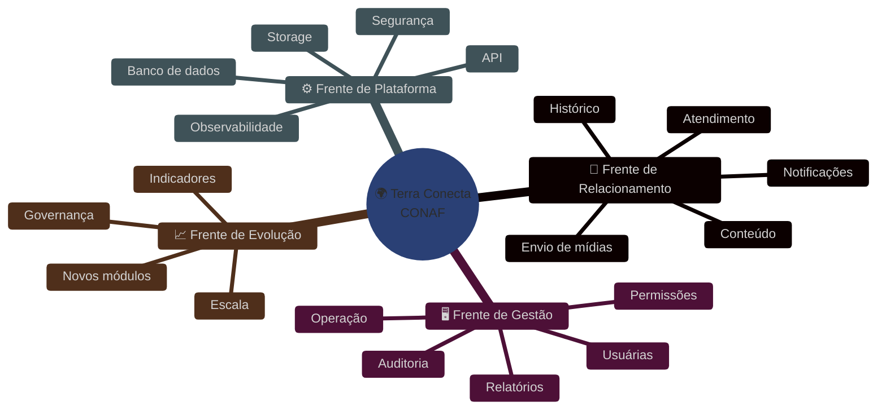
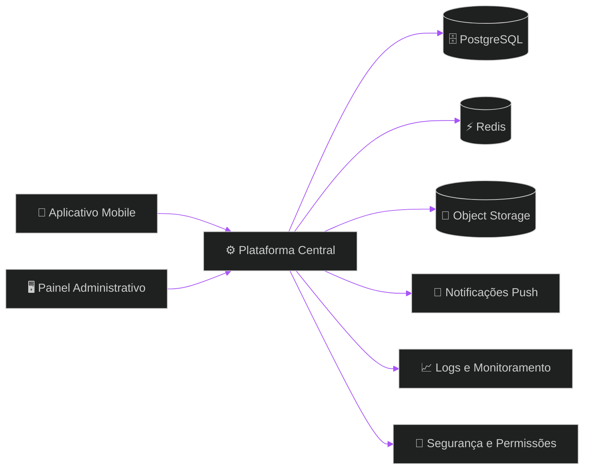
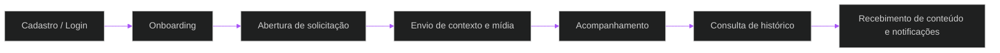
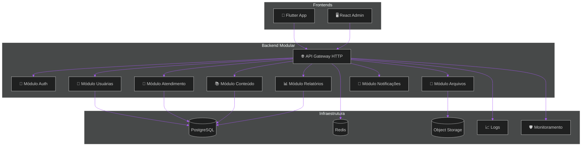
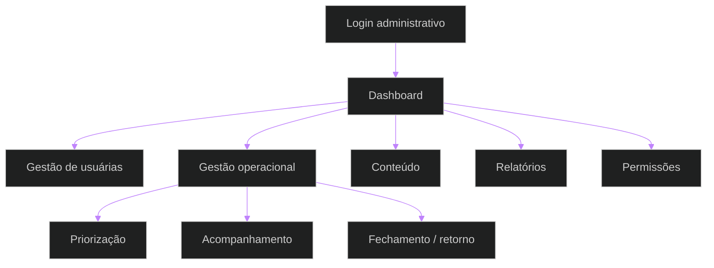
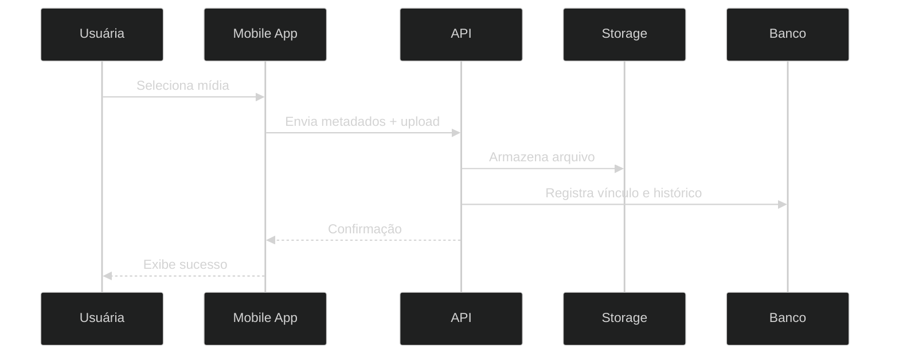
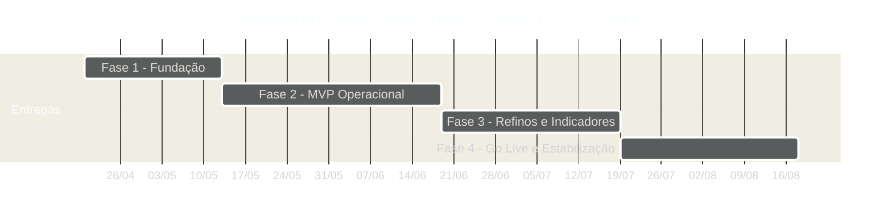

# 🚀 Terra Conecta — Proposta Institucional, Comercial e Técnica
## Plataforma digital enterprise para assistência técnica, gestão operacional, inteligência de dados e evolução comercial no ambiente rural da CONAF

> [!IMPORTANT]
> Esta proposta foi refinada para a **CONAF**, com foco em modernização operacional, controle de escopo, sustentabilidade técnica e equilíbrio entre capacidade de entrega, custo e impacto institucional.

> [!NOTE]
> O objetivo não é propor uma plataforma inflada. A proposta está calibrada para implantar uma base digital robusta, confiável e evolutiva, sem antecipar complexidades que não geram retorno imediato nesta fase.

> [!TIP]
> A melhor relação entre investimento e resultado, neste contexto, está em iniciar com arquitetura pragmática, governança forte, visão clara de riscos e um plano de entrega em ondas controladas.

---

# 📚 Sumário Executivo

1. Visão Estratégica  
2. Contexto Institucional da CONAF  
3. Problema de Negócio e Oportunidade  
4. Proposta de Valor  
5. Objetivos da Iniciativa  
6. Escopo Executivo da Solução  
7. Escopo Funcional Detalhado  
8. Fora de Escopo  
9. Perfis de Usuário e Jornada  
10. Arquitetura Corporativa Recomendada  
11. Diagramas Técnicos e Fluxos  
12. Tecnologias Recomendadas  
13. Matrizes Comparativas  
14. Matriz de Decisão Arquitetural  
15. Requisitos Funcionais  
16. Requisitos Não Funcionais  
17. Regras de Negócio  
18. Governança do Projeto  
19. Plano de Entrega e Cronograma  
20. Estratégia de Qualidade, Testes e Homologação  
21. Operação, Deploy e Sustentação  
22. Custos Operacionais Estimados  
23. Investimento Comercial  
24. Premissas Comerciais e de Execução  
25. Riscos e Mitigações  
26. Critérios de Sucesso  
27. Recomendações Finais

---

# 1. Visão Estratégica

A **CONAF** possui uma oportunidade concreta de elevar sua maturidade operacional por meio de uma plataforma digital própria, capaz de consolidar atendimento, gestão, conteúdo, histórico e inteligência institucional em um ecossistema centralizado.

O **Terra Conecta** foi concebido como uma iniciativa de transformação pragmática: reduzir dispersão operacional, estruturar dados, criar previsibilidade e dar base real para evolução futura da operação.

Mais do que um aplicativo, a proposta representa a criação de uma **infraestrutura digital institucional**, apta a sustentar processos, rastreabilidade, governança e expansão.

## Impactos Estratégicos Esperados

- consolidação de canais e fluxos operacionais;
- fortalecimento da capacidade de acompanhamento das usuárias;
- padronização do registro de atendimentos e interações;
- melhoria da previsibilidade da execução;
- produção de indicadores confiáveis para tomada de decisão;
- criação de base tecnológica própria para novos ciclos de crescimento.

---

# 2. Contexto Institucional da CONAF

A realidade operacional de organizações com atuação distribuída, relacionamento contínuo com público final e necessidade de acompanhamento individual costuma apresentar gargalos recorrentes:

- registros espalhados entre canais e pessoas;
- dependência de controles manuais;
- baixa rastreabilidade;
- dificuldade de consolidar histórico;
- limitação para gerar indicadores confiáveis;
- esforço elevado para manter continuidade operacional.

Na prática, isso reduz velocidade, aumenta retrabalho e enfraquece a capacidade de decisão institucional.

A proposta do **Terra Conecta** surge para enfrentar esse cenário com uma base digital estruturada, desenhada para a realidade da **CONAF**, respeitando restrições orçamentárias, necessidade de governança e evolução gradual.

---

# 3. Problema de Negócio e Oportunidade

## Situação atual sem plataforma dedicada

Quando a operação depende de múltiplos canais, registros dispersos e processos não padronizados, os efeitos mais comuns são:

- perda de contexto no atendimento;
- dificuldade para acompanhar a jornada das usuárias;
- baixa visibilidade gerencial;
- inconsistência de dados;
- dificuldade de prestação de contas;
- baixa escalabilidade institucional.

## Oportunidade concreta com a plataforma

Com o **Terra Conecta**, a **CONAF** passa a contar com:

- canal digital oficial;
- histórico centralizado por usuária;
- base única de atendimento e gestão;
- visão executiva consolidada;
- processo auditável;
- estrutura pronta para novas ondas de evolução.

> [!IMPORTANT]
> O ganho central não está apenas em “ter um sistema”. Está em substituir operação fragmentada por uma operação institucionalmente organizada.

---

# 4. Proposta de Valor

## Valor Institucional

- maior profissionalização da operação;
- fortalecimento da governança;
- base tecnológica própria;
- capacidade de expansão organizada;
- melhor rastreabilidade de ações e resultados.

## Valor Operacional

- menos retrabalho;
- menos perda de contexto;
- processos padronizados;
- histórico acessível e consultável;
- visão clara da execução.

## Valor Estratégico

- indicadores para tomada de decisão;
- priorização baseada em evidência;
- maior previsibilidade;
- preparação para novos produtos e frentes digitais.

---

# 5. Objetivos da Iniciativa

## Objetivo Geral

Implantar uma plataforma digital modular, segura e sustentável para apoiar atendimento, gestão, conteúdo, histórico e inteligência operacional da **CONAF**.

## Objetivos Específicos

- digitalizar jornadas operacionais críticas;
- centralizar o histórico de interações;
- disponibilizar painel administrativo com visão consolidada;
- estruturar indicadores essenciais;
- garantir segurança, rastreabilidade e governança;
- preparar base para expansão futura.

---

# 6. Escopo Executivo da Solução

A solução proposta está organizada em três frentes integradas.

## Frentes entregues

### 📱 Aplicativo Mobile
Canal principal de uso das usuárias finais.

### 🖥️ Painel Administrativo
Camada de gestão institucional, operação e visão executiva.

### ⚙️ Plataforma Central
Núcleo responsável por regras, persistência, segurança, observabilidade e sustentação.

---

# 7. Escopo Funcional Detalhado

# 📱 Aplicativo Mobile

## 7.1 Acesso e Identidade
- login seguro;
- recuperação de acesso;
- sessão autenticada;
- atualização de perfil básico;
- aceite de termos e políticas quando aplicável.

## 7.2 Jornada Inicial
- onboarding guiado;
- apresentação institucional;
- orientação de uso inicial;
- direcionamento para principais fluxos.

## 7.3 Atendimento e Solicitações
- abertura de solicitações;
- categorização básica;
- registro de contexto;
- atualização de status;
- acompanhamento do andamento.

## 7.4 Envio de Mídias
- upload de foto;
- upload de áudio;
- upload de vídeo;
- associação ao registro correto;
- consulta de anexos por histórico.

## 7.5 Conteúdo
- biblioteca de materiais;
- guias práticos;
- materiais orientativos;
- filtros básicos por categoria;
- visualização organizada.

## 7.6 Comunicação
- notificações push;
- alertas operacionais;
- comunicados relevantes;
- avisos de atualização e retorno.

## 7.7 Histórico
- linha do tempo individual;
- visualização de interações anteriores;
- continuidade de acompanhamento;
- consulta de anexos e registros.

---

# 🖥️ Painel Administrativo

## 7.8 Gestão de Usuárias
- cadastro;
- consulta;
- atualização;
- filtros;
- visualização de histórico consolidado.

## 7.9 Gestão Operacional
- acompanhamento de demandas;
- visão consolidada;
- organização por status;
- priorização de atividades;
- acompanhamento de fluxos críticos.

## 7.10 Gestão de Conteúdo
- cadastro de materiais;
- atualização de conteúdo;
- publicação controlada;
- controle de disponibilidade.

## 7.11 Relatórios e Indicadores
- visão executiva;
- visão operacional;
- métricas básicas de uso;
- métricas de acompanhamento;
- exportações simples quando aplicável.

## 7.12 Segurança e Permissões
- perfis de acesso;
- segregação de responsabilidades;
- permissões por papel;
- trilha de auditoria de ações sensíveis.

---

# ⚙️ Plataforma Central

## 7.13 Core API
- APIs REST;
- contratos claros;
- versionamento controlado;
- validação de entrada;
- padronização de respostas.

## 7.14 Segurança
- autenticação;
- autorização;
- proteção de rotas;
- segregação por perfil;
- boas práticas de segurança.

## 7.15 Dados e Persistência
- persistência relacional;
- consistência transacional quando aplicável;
- rastreabilidade;
- histórico de alterações relevantes.

## 7.16 Performance e Resiliência
- cache em pontos específicos;
- filas simples para operações oportunas;
- respostas eficientes;
- tratamento de falhas operacionais comuns.

## 7.17 Operação e Observabilidade
- logs estruturados;
- monitoramento;
- backups;
- pipelines de deploy;
- rastreamento de falhas.

> [!NOTE]
> O escopo foi desenhado para ser compatível com o investimento proposto. Capacidades mais avançadas podem ser incorporadas em ondas futuras sem comprometer a coerência arquitetural da base.

---

# 8. Fora de Escopo

Itens deliberadamente não contemplados nesta fase:

- marketplace transacional avançado;
- BI corporativo avançado;
- IA generativa embarcada;
- ERP rural completo;
- integrações legadas extensas;
- sensores de campo e IoT;
- automações comerciais complexas;
- multiempresa avançado;
- offline enterprise amplo;
- analytics preditivo avançado;
- customizações extensas fora do escopo contratado.

> [!IMPORTANT]
> Definir claramente o fora de escopo é essencial para proteger prazo, orçamento e qualidade. A ausência dessa disciplina compromete viabilidade.

---

# 9. Perfis de Usuário e Jornada

## Perfis principais

### Usuária Final
Interage pelo aplicativo, envia informações, consulta histórico, recebe conteúdo e acompanha retornos.

### Operadora/Equipe Interna
Gerencia cadastros, acompanha solicitações, consulta histórico, publica conteúdo e monitora andamento.

### Gestora/Coordenação
Acompanha indicadores, valida prioridades, consulta relatórios e monitora a performance operacional.

### Administradora do Sistema
Gerencia perfis, permissões, parâmetros e governança técnica básica.

## Jornada macro

---

# 10. Arquitetura Corporativa Recomendada

## Escolha arquitetural: monólito modular

A recomendação para a **CONAF** é um **monólito modular**, com domínios organizados internamente e infraestrutura preparada para crescimento gradual.

Essa escolha equilibra:

- custo de implantação;
- velocidade de entrega;
- previsibilidade operacional;
- simplicidade de manutenção;
- menor risco de arquitetura excessiva;
- capacidade de expansão futura por módulos.

## Racional da escolha

Microserviços, embora sejam úteis em determinados cenários, adicionam sobrecarga operacional, complexidade de deploy, exigência maior de observabilidade, contratos distribuídos e custo superior de sustentação. Para esta etapa, isso reduziria eficiência e aumentaria risco sem ganho proporcional.

## Evolução natural esperada

A base pode crescer em três direções:

- novos módulos dentro do próprio backend modular;
- incremento de integrações externas conforme necessidade real;
- eventual extração de capacidades específicas no futuro, se houver escala que justifique.

---

# 11. Diagramas Técnicos e Fluxos

## 11.1 Fluxo funcional de atendimento

## 11.2 Fluxo administrativo e gerencial

## 11.3 Fluxo técnico de upload de mídias

## 11.4 Fluxo de deploy e governança técnica

---

# 12. Tecnologias Recomendadas

## Mobile
**Flutter**

Motivos:
- boa produtividade;
- experiência visual consistente;
- base única de código;
- boa performance;
- custo-benefício adequado para MVP e evolução.

## Painel Web
**React**

Motivos:
- boa maturidade de ecossistema;
- flexibilidade para painel administrativo;
- excelente aderência a dashboards e interfaces internas.

## Backend
**NestJS + TypeScript**

Motivos:
- organização modular;
- tipagem forte;
- boa escalabilidade estrutural;
- facilidade para manter contratos claros;
- bom fit para APIs institucionais.

## Banco de Dados
**PostgreSQL**

Motivos:
- robustez;
- confiabilidade;
- recursos avançados;
- aderência a aplicações corporativas.

## Cache/Filas Leves
**Redis**

Motivos:
- simplicidade operacional;
- bom suporte a cache e filas curtas;
- apoio a notificações e aceleração de fluxos.

## Storage
**Object Storage compatível com S3**

Motivos:
- bom custo para arquivos;
- escalabilidade;
- segurança;
- separação adequada entre dados estruturados e anexos.

## Observabilidade
**Logs estruturados + monitoramento de ambiente**

Motivos:
- suporte à sustentação;
- melhor capacidade de diagnóstico;
- redução de tempo de resposta a falhas.

---

# 13. Matrizes Comparativas

## 13.1 Mobile

| Critério | Peso | Flutter | React Native | Observação |
|---|---:|---:|---:|---|
| Performance | 5 | 9 | 7 | Flutter leva vantagem |
| Consistência UI | 4 | 9 | 8 | Flutter favorece uniformidade |
| Produtividade | 4 | 9 | 9 | Equilíbrio |
| Manutenção | 4 | 9 | 8 | Flutter ligeiramente melhor |
| Ecossistema | 3 | 8 | 9 | React Native competitivo |
| Total ponderado |  | **118** | **106** | **Escolha: Flutter** |

## 13.2 Backend

| Critério | Peso | NestJS | Laravel | Observação |
|---|---:|---:|---:|---|
| Organização modular | 5 | 10 | 8 | NestJS superior |
| Tipagem e contratos | 5 | 10 | 6 | NestJS superior |
| Escalabilidade estrutural | 4 | 9 | 8 | NestJS melhor |
| Velocidade de evolução | 4 | 9 | 8 | Leve vantagem NestJS |
| Aderência ao time técnico | 4 | 9 | 7 | NestJS mais aderente |
| Total ponderado |  | **154** | **120** | **Escolha: NestJS** |

## 13.3 Banco de Dados

| Critério | Peso | PostgreSQL | MySQL | Observação |
|---|---:|---:|---:|---|
| Robustez | 5 | 10 | 8 | PostgreSQL superior |
| Recursos avançados | 4 | 9 | 7 | PostgreSQL superior |
| Crescimento futuro | 4 | 9 | 8 | PostgreSQL melhor |
| Confiabilidade | 5 | 10 | 8 | PostgreSQL melhor |
| Total ponderado |  | **122** | **96** | **Escolha: PostgreSQL** |

## 13.4 Arquitetura

| Critério | Peso | Monólito Modular | Microserviços | Observação |
|---|---:|---:|---:|---|
| Custo inicial | 5 | 10 | 4 | Monólito muito melhor |
| Velocidade de entrega | 5 | 10 | 5 | Monólito melhor |
| Operação | 4 | 9 | 5 | Monólito melhor |
| Complexidade | 5 | 9 | 4 | Monólito melhor |
| Evolução futura | 3 | 8 | 9 | Microserviços ganham aqui |
| Total ponderado |  | **154** | **86** | **Escolha: Monólito Modular** |

---

# 14. Matriz de Decisão Arquitetural

## Decisão consolidada

| Eixo de decisão | Opção recomendada | Justificativa |
|---|---|---|
| Aplicativo | Flutter | melhor equilíbrio entre custo, performance e consistência |
| Painel administrativo | React | excelente aderência a interfaces internas e dashboards |
| Backend | NestJS | modularidade, contratos, tipagem e crescimento sustentável |
| Banco | PostgreSQL | robustez e confiabilidade institucional |
| Cache/Fila leve | Redis | simplicidade e apoio a performance operacional |
| Arquitetura | Monólito Modular | menor risco, maior velocidade e melhor custo-benefício |
| Armazenamento | Object Storage | melhor adequação para anexos e mídias |
| Observabilidade | Logs + monitoramento | sustentação mínima madura para produção |

> [!IMPORTANT]
> A matriz de decisão foi construída para maximizar viabilidade real, e não para perseguir a arquitetura “mais sofisticada”. O critério dominante é adequação ao momento da CONAF.

---

# 15. Requisitos Funcionais

## Requisitos principais

- autenticação de usuárias e equipe interna;
- recuperação de acesso;
- cadastro e edição de perfis;
- abertura de solicitações;
- atualização de status de solicitações;
- envio e consulta de anexos;
- histórico individual por usuária;
- biblioteca de conteúdo;
- notificações relevantes;
- painel administrativo com filtros;
- dashboards executivos e operacionais;
- gestão de perfis e permissões;
- trilha de auditoria para ações sensíveis.

## Requisitos complementares

- busca básica;
- categorização de conteúdos;
- categorização de atendimentos;
- indicadores mínimos de uso e operação;
- exportação simples de informações estratégicas quando aplicável.

---

# 16. Requisitos Não Funcionais

## Segurança
- autenticação segura;
- proteção de rotas;
- segregação por papel;
- tratamento adequado de dados e acessos.

## Performance
- tempo de resposta adequado para fluxos principais;
- upload estável de arquivos;
- uso de cache em pontos necessários.

## Disponibilidade
- ambiente minimamente resiliente;
- monitoramento de saúde da aplicação;
- backups recorrentes.

## Observabilidade
- logs estruturados;
- monitoramento de falhas;
- visibilidade operacional.

## Manutenibilidade
- código organizado por domínios;
- contratos claros;
- modularidade coerente.

## Escalabilidade Controlada
- crescimento por módulos;
- ampliação progressiva de recursos;
- possibilidade de evoluções futuras sem reescrever a base.

## Usabilidade
- fluxo simples;
- linguagem objetiva;
- boa experiência no mobile e no painel.

---

# 17. Regras de Negócio

## Regras centrais

- cada usuária deve possuir histórico próprio e consultável;
- toda solicitação relevante deve ficar vinculada à usuária correta;
- anexos devem ser vinculados ao contexto certo;
- ações administrativas sensíveis devem ser rastreáveis;
- conteúdo publicado deve respeitar governança institucional;
- mudanças relevantes de escopo só entram mediante validação formal.

## Regras operacionais

- o status de um atendimento deve refletir o estado real da operação;
- conteúdos só podem ser publicados por perfis autorizados;
- acessos administrativos devem respeitar perfil e permissão;
- notificações devem estar associadas a eventos válidos;
- a exclusão lógica ou arquivamento deve ser preferível à perda de histórico, quando aplicável.

## Regras gerenciais

- indicadores devem ser extraídos de base confiável;
- decisões de priorização devem observar o backlog validado;
- entregas por fase dependem de aceite formal;
- riscos devem ser revisados periodicamente.

---

# 18. Governança do Projeto

## Modelo de governança

- checkpoint semanal;
- review quinzenal de andamento;
- backlog priorizado;
- registro formal de decisões;
- gestão de mudanças;
- tratamento contínuo de riscos;
- validação por marcos.

## Papéis esperados

### CONAF
- definir prioridades;
- validar regras de negócio;
- homologar entregas;
- indicar responsáveis de contato.

### Equipe de Entrega
- conduzir arquitetura e desenvolvimento;
- manter previsibilidade;
- registrar riscos e desvios;
- executar testes e suporte inicial.

## Gestão de mudanças

Qualquer solicitação que altere escopo, prazo ou esforço deve seguir fluxo formal de avaliação de impacto.

---

# 19. Plano de Entrega e Cronograma

## Estratégia de entrega

A entrega é organizada em **fases progressivas**, com objetivo claro por etapa e critérios de aceite definidos. Isso reduz risco, melhora previsibilidade e facilita tomada de decisão.

| Fase | Objetivo | Prazo estimado |
|---|---|---|
| 1 | Fundação técnica, arquitetura, identidade básica e estruturas centrais | 3 semanas + 2 dias |
| 2 | MVP operacional mobile + painel administrativo base | 5 semanas + 2 dias |
| 3 | Indicadores, conteúdos, melhorias operacionais e refinamentos | 4 semanas + 2 dias |
| 4 | Homologação, go live assistido e estabilização inicial | 4 semanas + 2 dias |

## Visão do cronograma

## Forma de entrega por fase

### Fase 1 — Fundação
- setup da base técnica;
- arquitetura inicial;
- autenticação base;
- persistência inicial;
- estrutura do painel e mobile;
- preparação de ambiente.

### Fase 2 — MVP Operacional
- fluxos principais de uso;
- atendimento e solicitações;
- histórico e anexos;
- gestão de usuárias;
- operação base;
- conteúdo inicial.

### Fase 3 — Gestão e Refinamento
- indicadores;
- relatórios;
- melhorias de jornada;
- ajustes operacionais;
- revisão de regras e refino de usabilidade.

### Fase 4 — Entrada em Produção
- homologação final;
- ajustes críticos;
- preparação de produção;
- go live assistido;
- monitoramento inicial.

---

# 20. Estratégia de Qualidade, Testes e Homologação

## Princípios

- validar profundamente o que sustenta o negócio;
- testar fluxos críticos antes de cenários periféricos;
- homologar por fase;
- evitar entrada em produção sem visibilidade técnica mínima.

## Tipos de testes previstos

- testes funcionais;
- testes de integração;
- regressão de fluxos principais;
- smoke tests;
- testes de upload/anexos;
- testes de permissão;
- homologação assistida com a CONAF.

## Homologação

Cada fase deve possuir:
- escopo acordado;
- evidência de funcionamento;
- validação formal;
- lista de pendências e ajustes, quando existirem.

---

# 21. Operação, Deploy e Sustentação

## Ambientes
- desenvolvimento;
- staging;
- produção.

## Operação prevista
- logs centralizados;
- monitoramento de disponibilidade;
- backup recorrente;
- acompanhamento pós go live;
- resposta inicial a incidentes críticos.

## Pipeline de entrega
- versionamento;
- revisão de código;
- build;
- testes;
- deploy controlado;
- validação posterior.

## Sustentação inicial
A proposta considera um período inicial de acompanhamento do go live para estabilização e correções prioritárias.

---

# 22. Custos Operacionais Estimados

Os custos abaixo representam uma **faixa estimada mensal**, compatível com uma operação inicial disciplinada. O valor exato depende de volume de uso, mídia, ambiente contratado e necessidade de observabilidade.

| Item | Faixa estimada mensal |
|---|---:|
| Infra de aplicação | R$ 400 a R$ 800 |
| Banco de dados | R$ 250 a R$ 500 |
| Storage de arquivos | R$ 120 a R$ 300 |
| Monitoramento e logs | R$ 150 a R$ 350 |
| Backup | R$ 80 a R$ 180 |
| Serviços auxiliares e contingências | R$ 100 a R$ 250 |
| **Total médio estimado** | **R$ 1.100 a R$ 2.380 / mês** |

## Leitura executiva dos custos

- cenário enxuto: operação inicial com baixo volume;
- cenário médio: operação com uso recorrente e crescimento controlado;
- cenário ampliado: mais mídia, maior tráfego e maior demanda de acompanhamento.

> [!NOTE]
> A proposta comercial de implantação não inclui, por padrão, cobrança mensal de infraestrutura. A operação recorrente deve ser tratada como custo da plataforma em produção.

---

# 23. Investimento Comercial

# 💎 Investimento Total Proposto: **R$ 30.000,00**

## Estrutura de pagamento sugerida

| Marco | Percentual | Valor |
|---|---:|---:|
| Assinatura + Kickoff | 40% | R$ 12.000 |
| Entrega e aceite da Fase 1 | 20% | R$ 6.000 |
| Entrega e aceite da Fase 2 | 20% | R$ 6.000 |
| Entrega e aceite final / Go Live | 20% | R$ 6.000 |

## O que o investimento cobre

- planejamento e estruturação da solução;
- arquitetura e implementação;
- mobile e painel no escopo definido;
- backend e persistência;
- integrações internas necessárias ao escopo;
- testes e homologação por fase;
- preparação de produção e acompanhamento inicial.

---

# 24. Premissas Comerciais e de Execução

## Premissas
- disponibilidade da CONAF para validações e homologações;
- definição clara de responsáveis pelo lado cliente;
- aprovação por marcos;
- estabilidade mínima das prioridades por fase;
- alterações relevantes tratadas via reavaliação.

## Não incluído no valor base
- demandas fora do escopo;
- integrações não previstas;
- evoluções avançadas;
- operação contínua mensal de longa duração;
- licenças ou serviços de terceiros não contemplados.

---

# 25. Riscos e Mitigações

## Matriz executiva de risco

| Risco | Probabilidade | Impacto | Nível | Mitigação |
|---|---|---|---|---|
| Crescimento de escopo | Alta | Alto | Crítico | gestão formal de mudanças e congelamento por fase |
| Atraso em validações da CONAF | Média | Alto | Alto | agenda antecipada e checkpoints obrigatórios |
| Regras de negócio incompletas | Média | Alto | Alto | refinamento contínuo com responsáveis-chave |
| Baixa adoção inicial | Média | Alto | Alto | onboarding, comunicação e treinamento |
| Infra inadequada ao uso real | Baixa | Médio | Moderado | monitoramento e ajuste de capacidade |
| Dados inconsistentes na origem | Média | Alto | Alto | validação, revisão de cadastro e auditoria |
| Alterações tardias de prioridade | Média | Médio | Moderado | replanejamento formal e backlog priorizado |
| Dependência de terceiros | Média | Médio | Moderado | contingência técnica e escolha de serviços maduros |
| Excesso de anexos / mídia | Média | Médio | Moderado | política de uso e monitoramento de storage |
| Falhas operacionais pós go live | Baixa | Alto | Moderado | go live assistido e resposta prioritária inicial |

## Leitura de risco por categoria

### Riscos de escopo
Relacionados a aumento de demandas não previstas, alterações de prioridade e extensão indevida da entrega.

### Riscos de negócio
Relacionados a baixa adesão, expectativas desalinhadas e regras operacionais insuficientemente definidas.

### Riscos técnicos
Relacionados a infraestrutura, mídia, performance e manutenção inicial.

### Riscos de governança
Relacionados a atraso de decisões, homologações tardias e ausência de responsáveis claros.

> [!IMPORTANT]
> O risco mais relevante, neste tipo de projeto, não costuma ser tecnologia. É desalinhamento entre escopo, prioridade, governança e expectativa de entrega.

---

# 26. Critérios de Sucesso

A iniciativa será considerada bem-sucedida se, ao final do ciclo proposto, a **CONAF** tiver:

- plataforma funcional em produção;
- fluxos principais digitalizados;
- histórico estruturado por usuária;
- painel administrativo utilizável;
- visão mínima de indicadores;
- governança operacional mais clara;
- base tecnológica apta para evolução futura.

## Indicadores qualitativos de sucesso

- menor retrabalho;
- mais previsibilidade;
- mais rastreabilidade;
- melhor capacidade de acompanhamento;
- maior clareza para decisão.

---

# 27. Recomendações Finais

O **Terra Conecta** apresenta uma combinação sólida entre:

- valor institucional;
- viabilidade financeira;
- arquitetura correta para o estágio atual;
- escopo realista;
- potencial de expansão futura.

## Síntese final

Com investimento de **R$ 30.000,00**, cronograma em fases, governança adequada e disciplina de escopo, o projeto possui condições concretas de gerar resultado real para a **CONAF** e posicionar a operação em novo patamar de maturidade digital.

> [!IMPORTANT]
> O sucesso desta proposta não depende de adicionar mais funcionalidades agora. Depende de executar com consistência o que é estruturalmente certo nesta fase: base sólida, boa governança, operação organizada e expansão guiada por uso real.
